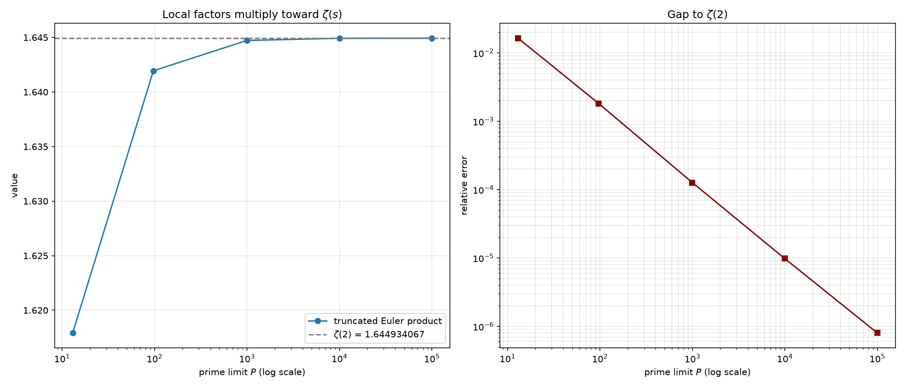
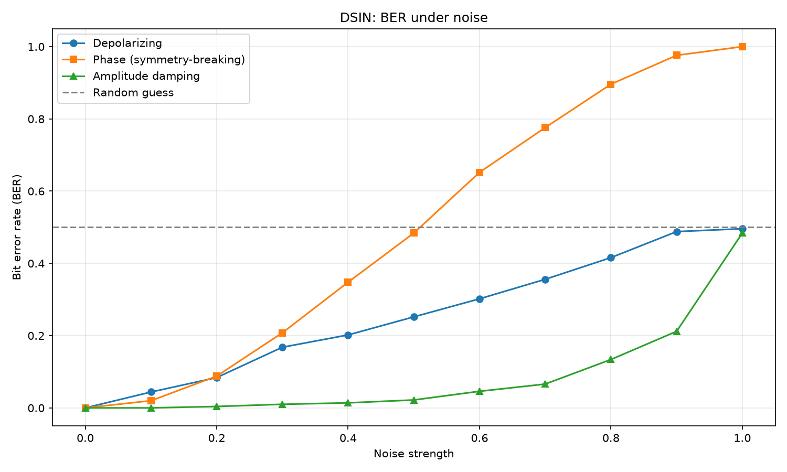
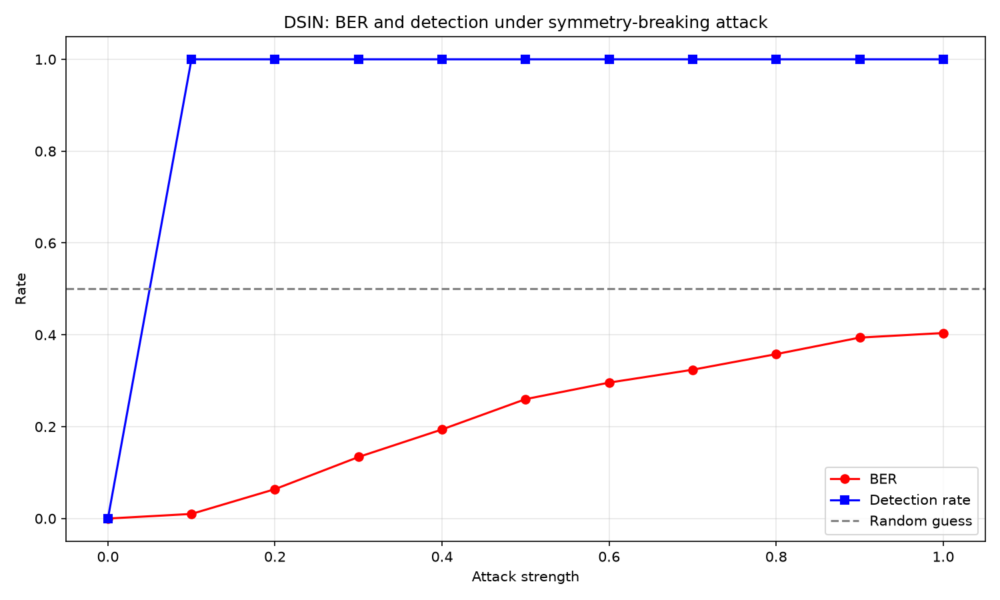
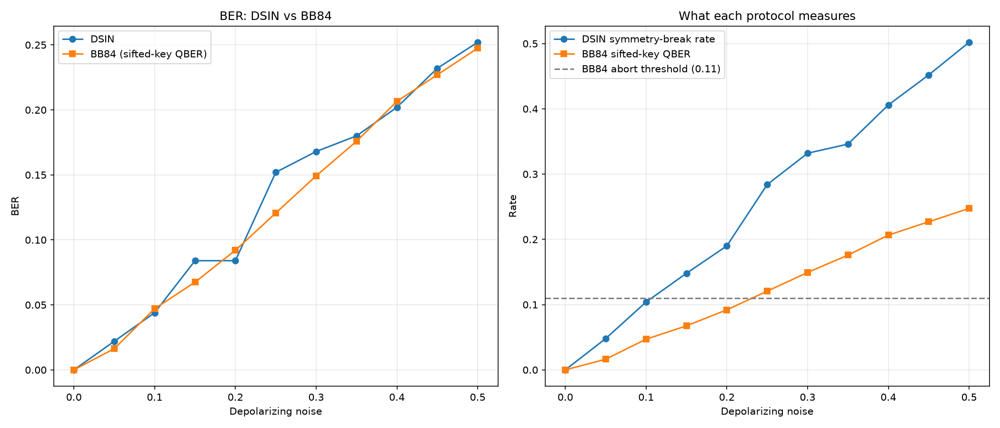
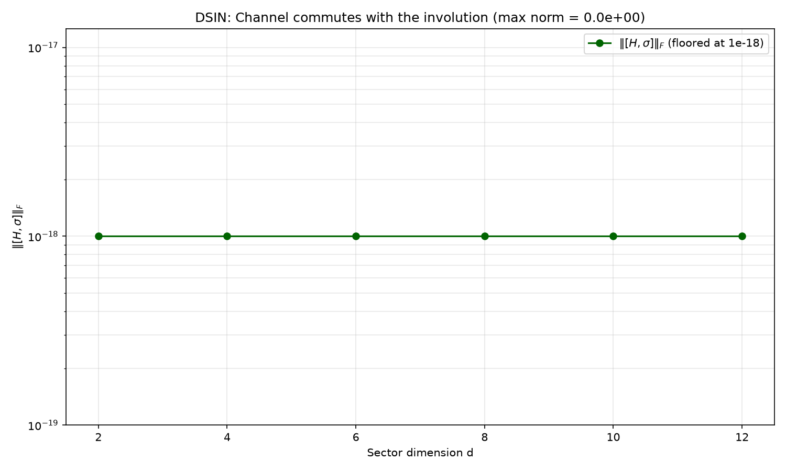

# Riemann Framework

Riemann Framework is an experimental workbench for exploring the Riemann
Hypothesis (RH), not a proof attempt. It combines numerical experiments in
Python with a Lean 4 formalization, covering zeta zeros, the explicit formula,
prime counting, dimension-shift models, graded algebras, and exotic number
systems.

Speculative ideas are stated precisely, tested against real mathematics and
real controls, and reported honestly, including when they fail. Several tracks
here *do* fail, on purpose and on record: a negative result obtained by a
stated method is worth more than an unfalsifiable claim of progress. Nothing in
this repository claims to prove RH; passing tests are research evidence, not a
completed proof.

## Disclaimer

This project is **not a proof** of the Riemann Hypothesis. It is a tool to:

- test the RH **numerically** for known zeros,
- verify **formal proof attempts** in Lean 4,
- visualize and analyze the **explicit formula**.

A passing test is **evidence**, not a mathematical proof.

## Status

| Component | Status |
|:---|:---|
| Numerical zero verification | Working |
| Explicit-formula calculations and plots | Working |
| Dimension-shift experiments | Working and exploratory |
| Dimension-shift falsification grid | Working; single seed, verdict interpretation still coarse |
| DSIN communication simulation | **Closed design.** Toy simulation with a BB84 baseline (`bb84.py`); its single published observable provably cannot support a security bound. See [`docs/future_work.md`](docs/future_work.md) Priority 6 |
| Lean formalization of RH | Involution and eigenspace lemmas proved; RH formalization not started |
| Primon-gas anchor | Exact trace identity implemented and tested; anchors the Euler product, not the zeros |
| Graded prime monoid | `(ℕ_{>0}, ×)` identified with the free commutative monoid on the primes; exponent-vector addition shown to be the **only** rule compatible with unique factorization, and to be exactly what makes the Euler product factorize. Ordinary arithmetic restated, not a new number system — see [`docs/graded_prime_monoid.md`](docs/graded_prime_monoid.md) |
| Shift-zeta (graded algebra) | **Negative result.** Well-defined and tested; does **not** reproduce the classical zeros. See [`docs/shift_zeta_result.md`](docs/shift_zeta_result.md) |
| Cayley-Dickson / four-square study | Confirms Hurwitz's dimension limit (1,2,4,8); confirms a genuine Euler-product identity at dimension 4 (`ζ(s)ζ(s-1)`), which does not by itself constrain the zeros of `ζ` |
| Idea-vetting pipeline | Working; five stages (A–E), enforced falsification criteria |
| Formal proof of RH | Open problem |
| Test suite | **493 tests passing**; includes the negative results and a regression test for each corrected bug |

## The idea-vetting pipeline

Because this repository accumulates speculative proposals, every candidate idea
is expected to pass through the same gate before it is taken seriously. It is
implemented in `riemann_framework/idea_pipeline.py` and documented in
`docs/project_critique_and_roadmap.md`.

An "idea" is a small JSON record under `ideas/*.json` that must state, up
front, what observation would falsify it (stage E, enforced at construction).
Stages A–D2 reuse the existing modules:

| Stage | Question | Tooling |
|:---|:---|:---|
| **A** — Well-formedness | Is the proposed object/map even well-defined? | Parsing / manual review |
| **B** — Triviality reduction | Is it secretly an affine combination of `s` and `conjugate(s)` — i.e. a known rotation/reflection in disguise? | `affine_reduction.py` (numeric second-difference test) |
| **C** — Statistical plausibility | If it produces a spectrum, how does its level-spacing statistic compare to matched Poisson / GOE / GUE baselines? | Gap-ratio statistics with bootstrap confidence intervals |
| **D** — Arithmetic coupling | Does the map interact with the primes at all (via Euler-factor exponents `p^{-s}`), or only with the geometry of the plane? **Gates**: no p-dependence is precisely the arithmetic clause a falsification criterion names | Numeric probe against `p^{-s}`, reported as `commutes` / `uniform_failure` / `p_dependent` |
| **D2** — Operator realization | If a symmetry is proposed on the *primon gas* (Track 4), does it actually commute with the Hamiltonian? | Commutator norm test |
| **E** — Falsifiability | Does the idea state, in advance, what observation would count against it? | Enforced by the `ideas/*.json` / `*.yaml` schema at construction time |

```bash
python scripts/run_idea_pipeline.py
```

No verdict here ever says an idea is "true" or "proven" — only how far it got
before hitting a known limitation, a statistical mismatch, or a genuinely open
question. `ideas/` currently records, among others, `dimension_shift_w` (fails
stage B — it is exactly the functional-equation reflection), and
`dimension_lift_euler_product` (clears stage B non-trivially and produces a
real, if limited, Euler-product identity — see Track 5).

The stage-D probe (`probe_multiplicative_coupling`) was corrected from an
earlier prototype version whose per-prime relative error cancelled the `log p`
factor, making its "p-dependent mismatch" flag provably unreachable. The
corrected comparison is `w(p^{-s})` versus `p^{-w(s)}`, which the identity map
satisfies exactly (spread ~0) and the reflection `1 - conj(s)` does not
(spread ~0.28).

## Numerical core

The foundation everyone else builds on:

- **`zeta.py` / `zeros.py`** — thin, careful `mpmath` wrappers for evaluating `ζ(s)` and locating/verifying non-trivial zeros to arbitrary precision.
- **`explicit_formula.py`** — the Riemann–von Mangoldt explicit formula linking sums over zeros to sums over prime powers, with regularization for numerical evaluation.
- **`spectral_density.py`** — diagnostics comparing a cumulative zero count against the Riemann–von Mangoldt asymptotic `N(T) ~ (T/2π)log(T/2πe)`.
- **`plots.py` / `generate_plots.py` / `test_plot.py`** — the plotting layer behind every figure in this README.

This layer makes no novel claims; it exists so every other track has a trustworthy ground truth to compare against.

## The dimension-shift programme

### The central hypothesis

Documented in full in `docs/central_hypothesis.md`. The **Dimension-Shift Hypothesis (DSH)** conjectures a family of self-adjoint Hamiltonians `H(λ)` on a `Z₂`-graded Hilbert space, together with a discrete involution `σ`, such that:

1. `[H(λ), σ] = 0` in the intended regime;
2. the spectral density of `H(λ)` matches the Riemann–von Mangoldt asymptotic;
3. a precisely defined spectral subsequence corresponds to the non-trivial zeta zeros;
4. a fixed-locus or positivity argument forces those zeros onto `Re(s) = 1/2`;
5. the local level statistics are GUE-like.

This is intentionally a stronger requirement than "the model looks chaotic" — GUE statistics alone are cheap and do not by themselves encode the Euler product or any individual zero.

### The prototype involution

On the complex plane the prototype is the reflection

```
σ(s) = 1 - conjugate(s),        σ(σ(s)) = s,        σ(s) = s  ⟺  Re(s) = 1/2
```

Run through the vetting pipeline (`affine_reduction.py`), this is honestly recorded as a **known affine map** — the functional-equation reflection composed with conjugation — not a new algebraic object:

```python
from riemann_framework.affine_reduction import check_affine_reduction

result = check_affine_reduction("1 - s_conj")
print(result.is_affine)      # True  -> a known affine map
print(result.coefficients)   # (0j, (-1+0j), (1+0j))  -> 0*s - 1*conj(s) + 1
```

Its fixed locus is nonetheless exactly the critical line, which is the property the wider programme actually needs; see `docs/dimension_shift_involution.md` §2.1 for the full discussion of why triviality as an algebraic object does not disqualify it as a *symmetry* to build a Hamiltonian around.

### Chaos models, statistics, and the falsification grid

- **`dimension_shift_chaos.py`** — a family of coupled Hamiltonians built around the sector-swap involution, with a coupling and a symmetry-breaking parameter.
- **`quantum_chaos.py` / `statistics.py`** — mean adjacent-gap ratio statistics (`⟨r⟩`), matched against Poisson (`≈0.386`), GOE (`≈0.531`), and GUE (`≈0.600`) reference values, with bootstrap confidence intervals.
- **`falsification_test.py`** — scans a grid over sector dimension, coupling strength, and symmetry breaking (90 parameter points), classifies each as Poisson-like / GOE-like / GUE-like / intermediate, and writes the result to `output/falsification_summary.txt` plus the heatmap and histogram figures below. This is stronger than presenting only favorable plots: it also exposes the parameter regions that do **not** support the target behavior.

### DSIN: a toy communication-channel simulation

**`dsin.py`** explores whether the dimension-shift structure could underlie a
communication protocol. This is explicitly labeled a toy simulation with **no
security proof** — it should not be equated with cryptographic protocols like
BB84, and `docs/dimension_shift_quantum_communication.md` is explicit about the
limitation.

**Verdict: the design is closed.** It is not merely unproven. A single published
observable carrying the bit means the adversary's measurement is always the right
one, and §4.1 of that document proves that no function of the observable's
statistic can bound her information. The sections below record the measurements
that establish it, and [`docs/future_work.md`](docs/future_work.md) Priority 6
carries the full verdict. What survives is the exact commutation result — a
`σ`-commuting channel preserves `Fix(σ)` — which was always true and was never a
security statement.

**The construction.** The state space is a two-sector (graded) Hilbert space
`H = H_b ⊕ H_f` of dimension `2d`, and the involution is the sector swap
`σ|b,k⟩ = |f,k⟩`, `σ|f,k⟩ = |b,k⟩`. A bit is encoded in the eigenvalue of `σ`:

| bit | state | `σ` eigenvalue |
|:---|:---|:---|
| 0 | `(|b,k⟩ + |f,k⟩)/√2` | `+1` |
| 1 | `(|b,k⟩ − |f,k⟩)/√2` | `−1` |

The channel Hamiltonian has the block form `[[H_b, V], [Vᵀ, H_f]]` with
`H_b = H_f` and `V = Vᵀ`, which makes `[H, σ] = 0` **exactly**: the commutator
norm is `0.00e+00` for every dimension up to `d = 12`, not merely small.
Detection measures whether the received state is still a `σ` eigenstate.

**Models available.** Noise: `none`, `depolarizing`, `phase` (a relative phase on
the fermionic sector), `amplitude` (damping of that sector). Attacks:
`intercept_resend`, `symmetry_breaking`, `partial_intercept` (intercept a
fraction `p` of the traffic), and `sigma_basis_intercept` — the last being the
one that decides the question, since it measures the encoding observable itself.
`run_simulation` returns the BER, the detection rate, the mean fidelity against
the transmitted state, and `mean_sigma_deviation`, the graded statistic the
detector thresholds. `channel_time` defaults to `0.0` — no Hamiltonian evolution
— so the ideal channel has unit fidelity; set it nonzero to include evolution
under `H`.

**Measured results** (`python scripts/run_dsin_verification.py`, `n = 500`, seed 42):

| scenario | BER | detection rate |
|:---|:---|:---|
| ideal channel | 0.0000 | 0.0000 |
| depolarizing `p = 0.1` / `0.3` / `0.5` | 0.044 / 0.168 / 0.252 | 0.104 / 0.332 / 0.502 |
| symmetry-breaking `ε = 0.1` / `0.5` / `1.0` | 0.010 / 0.260 / 0.404 | 1.000 / 1.000 / 1.000 |
| intercept-resend (mean of 5 seeds) | 0.4528 | 1.0000 |

The detector is a **witness** of symmetry breaking, not a graded measure: any
departure from the `σ` eigenspace trips it, so the symmetry-breaking and
intercept-resend detection rates sit at 1.000 even for small `ε`, while the BER
grows with `ε`. That is the honest reading of the table — the detector answers
"was the symmetry broken?", not "by how much?". Depolarizing noise gives a graded
response only because it destroys the state outright with probability `p`, so
detection tracks `p`.

**A total, undetectable break.** The detector tests whether the received state is
*an* eigenstate of `σ` (`|⟨σ⟩| = 1`) — not whether it is the eigenstate that was
sent, which the receiver cannot know. That distinction is not academic. Phase
noise multiplies the fermionic sector by `e^{iφ}`, which sends `⟨σ⟩` to `±cos φ`;
at `φ = π` it maps the `+1` eigenspace onto the `−1` eigenspace:

| `φ` | BER | detection |
|:---|:---|:---|
| `0.25π` | 0.1660 | 1.0000 |
| `0.50π` | 0.4840 | 1.0000 |
| `0.75π` | 0.8440 | 1.0000 |
| **`π`** | **1.0000** | **0.0000** |

So the unitary `diag(I, −I)` inverts **every** transmitted bit while the detector
reports nothing whatsoever. This is a property of the protocol as modelled, not a
coding error, and `test_phase_flip_at_pi_inverts_every_bit_and_is_invisible` pins
it so it cannot be lost silently. It is the concrete instance of the trap that
`docs/future_work.md` Priority 6 names: **symmetry covariance is not protection**.
Closing it needs a detector that checks eigen*value* consistency, which requires
either a shared key or a BB84-style basis-sampling check — a protocol redesign,
not a bug fix.

**No error-rate-to-information relation, and none is possible on this
observable.** The detector is binary, so a cautious eavesdropper is caught with
the same probability as a reckless one. The graded statistic behind it *does*
respond to attack strength — `SimulationResult.mean_sigma_deviation`, which rises
from **0.0100** at `ε = 0.05` to **0.6958** at `ε = 1.0` (`n = 1000`, seed 42) —
so the flat detection rate is a thresholding artefact and a graded detector is
one line away. Removing the threshold would not help. The same statistic reads
`2.22e-16` at `φ = π`, where every bit is inverted: it is *non-monotone in
damage*, reporting a perfectly undisturbed channel under a total break. (It is
stored as `|1 − |⟨σ⟩||` rather than `1 − |⟨σ⟩|` because `|⟨σ⟩|` rounds a few ulps
above 1, which makes the unsigned form report a small *negative* deviation for an
ideal channel.)

The sharpest witness is not the phase flip but an adversary who measures `σ`
itself — the receiver's own observable, in the published encoding basis. She
recovers every bit (`1.0000` of the time), and because the post-measurement state
of a state already inside the measured eigenspace is that state, Bob decodes
everything correctly (`BER = 0.0000`) and the detector reports `0.0000`, on a
deviation bit-identical to the no-eavesdropper run. Two strategies with equal
deviation and different leakage mean that **no function of that deviation can
bound the adversary's information**. That is a proof rather than a failure to
find the right inequality; it is stated as a proposition with proof in
[`docs/dimension_shift_quantum_communication.md`](docs/dimension_shift_quantum_communication.md)
§4.1, and `test_sigma_deviation_does_not_bound_leakage` pins it. In BB84 the
statistic and the bound are linked — Eve's information about the key is bounded
by the disturbance she causes — and that link is what a security proof is built
from. DSIN has no such relation, which is a second and independent reason (beyond
the absent proof machinery) that it cannot be set against BB84's guarantee.

The entropic-uncertainty route is closed as well, and for a structural reason
rather than a technical one. An uncertainty relation needs *two* mutually
unbiased observables; a single-observable design has overlap `c = 1` and
therefore no `log2(1/c)` term to bound anything with. The natural second
observable in the DSIN sector — the sector basis, with `c = 1/2` — does give a
non-degenerate relation, but it makes each 2-dimensional sector block *be* BB84,
so it proves BB84's theorem rather than a new one. See §4.3.

**What would have to change.** None of this means the *track* is closed, only that
this design is. §4.4 of the same document converts the failure into a requirements
list (R1–R4) that any successor has to meet; records why the obvious repair —
moving the payload into the interior of `Fix(σ)` — relocates the hole rather than
closing it, in coding terms because the adversary's payload measurement is a
*logical operator* and no stabilizer can see one; and sketches two directions that
are at least well-posed. It states requirements rather than results and makes no
security claim.

**A modelling bug found and fixed while writing this up.** The original
`symmetry_breaking_attack` perturbed the two sectors by `+m` and `−m` with the
*same* random `m`. That vector is `σ`-*odd*, so it lies inside the `−1`
eigenspace — which is exactly the bit-1 encoding — and left bit-1 states
undisturbed to machine precision (`|⟨σ⟩| = 1.000000`). The reported "detection
rate" was therefore ≈ 0.53 **regardless of `ε`**: it was tracking the fraction of
rounds that happened to encode bit 0, not any detection capability at all. The
fix perturbs the sectors independently, so the perturbation carries both
`σ`-even and `σ`-odd parts and disturbs both encodings (`|⟨σ⟩|` drops to ≈ 0.50
for each). It is recorded here rather than silently corrected because the wrong
number looked entirely plausible, and
`test_symmetry_breaking_attack_disturbs_both_encodings` now pins it.

**Neither number is a calibrated detection probability, and the fix did not make
detection better.** The detector is unchanged — it was equally binary before and
after. The old ≈ 0.53 measured how much of the traffic the attack could reach at
all; the new 1.0000 records only that the alarm is not graded. Reading the change
as "detection improved from 0.53 to 1.000" would be a mistake: detection
probability is a step function of attack strength in both cases, and the flat
1.0000 is not progress on the gap named in
[`docs/dimension_shift_quantum_communication.md`](docs/dimension_shift_quantum_communication.md)
§4.1 — it is the same gap, now measured correctly.

**Comparison with BB84.** `bb84.py` provides the baseline, because a protocol
claim is meaningless without one. The two protocols do not detect eavesdropping
the same way, and the comparison is only readable if that is stated:

| depolarizing noise | DSIN BER | BB84 sifted-key QBER | BB84 verdict |
|:---|:---|:---|:---|
| 0.00 | 0.0000 | 0.0000 | not detected |
| 0.10 | 0.0440 | 0.0409 | not detected |
| 0.20 | 0.0840 | 0.1004 | not detected |
| 0.30 | 0.1680 | 0.1357 | **detected** |

DSIN watches a per-round symmetry observable, so its detection rate is a genuine
per-round frequency. BB84 has no per-round detection event: Alice's and Bob's
bases are chosen independently at random, so they disagree about half the time
whether or not anyone is listening, and those rounds are simply discarded in
sifting. BB84 works from the rounds that survive — the sifted key — by estimating
its error rate and aborting above a threshold (0.11 by default, the value used
above). An earlier version of `bb84.py` counted basis mismatch as "detection",
which reported ≈ 0.5 in every row: it was measuring sifting, not eavesdropping.
`run_bb84` now returns the sifted-key QBER as `ber`, a run-level `detected`
flag, and `sifting_discard_rate` separately, so the two cannot be confused
again.

**What this is not.** Not a security proof, and not a candidate for one —
[`docs/dimension_shift_quantum_communication.md`](docs/dimension_shift_quantum_communication.md)
§4.1 is the proof that none is available. There is no comparison with BB84's
security guarantee, no detector noise model, no finite-key analysis, and no
adversary beyond the four attacks modelled in `dsin.py`. §4.4 of that document
lists what a successor would need, and
[`docs/future_work.md`](docs/future_work.md) Priority 6 carries the verdict.

## Shift-zeta: a graded-algebra lift (negative result)

Full detail in `docs/shift_zeta_result.md`; this is the most rigorously negative result in the repository, and it is reported as such rather than downplayed.

**The question:** does lifting the Euler product into a `Z₂`-graded algebra `A = A₀ + ωA₁` (with `ω² = 1`, involution `σ(x) = ωxω`, and local factors `1/(1 - p^{-s}γ_τ)` where `γ_τ = ((1+τ)/2)I + ((1-τ)/2)ω`) force the zeros of the resulting "shift-zeta" into the fixed locus `Fix(σ) = A₀` (i.e. the critical line's algebraic analogue)?

**The answer: no.** Measured over 600 primes:

- The algebra is well-defined, and `σ` is a genuine algebra homomorphism (**G1, G2 pass**).
- The graded trace is `σ`-invariant; the supertrace is `σ`-*anti*-invariant — these are different, non-conflicting functionals (**G3, F5 both hold**).
- At `τ = 1` — the degenerate control case — the graded trace equals the classical Euler product term for term (relative error `5.1×10⁻⁴` at `s=2`, pure truncation) (**G7 passes**). This confirms the methodology is sound: the machinery *can* reproduce `ζ` exactly when it is supposed to.
- For `τ ≠ 1`, the trace departs from `ζ` by **11%–44%** at `s=2`, and the completion (functional-equation) symmetry fails with residuals of `10⁻²`–`10⁻¹`, three to ten orders of magnitude above the numerical noise floor of the `τ=1` control (**G5 fails**).
- Most decisively: at `τ=1`, where the trace is provably the classical product, it dips sharply and exactly at every classical zero — a positive control showing the diagnostic works. At `τ≠1`, the trace is instead **3.5×–7.5× larger** at those same heights, with no corresponding dip. The zero sets do not coincide (**G6 fails**, triggering falsification criterion **F1**).

**Why it fails, structurally:** every local factor in the graded product is a polynomial in a single element `γ_τ`, so the product never leaves the two-dimensional subalgebra `C[γ_τ]` — there is no interaction between different primes' contributions inside the grading. This is the concrete mechanism, not just an empirical shortfall, and it is the kind of obstruction the framework's own Stage-D arithmetic-coupling test is designed to catch in future proposals before months are spent on them.

No criterion failure here says anything about whether RH is true; it says this specific graded lift does not reproduce the classical zeros, and it explains why in terms that generalize to other naive lifts.

```powershell
python scripts/run_shift_zeta_analysis.py
```

The figures below are diagnostic, not evidence about zero locations; read the caveats in `scripts/run_shift_zeta_analysis.py` before drawing conclusions from them.


## The primon gas: an exact arithmetic anchor

The one place in this repository where the Euler product is not modeled or approximated but **provably present**, due to Julia (1990) and Spector (1990), refined into the Bost–Connes system (1995).

On `ℓ²(ℕ)` with orthonormal basis `|n⟩`, define the diagonal Hamiltonian

```
H|n⟩ = log(n)|n⟩
```

Then, exactly, for `Re(s) > 1`:

```
Tr[e^{-sH}] = Σ_n n^{-s} = ζ(s) = Π_p 1/(1 - p^{-s})
```

This falls directly out of unique prime factorization: `ℓ²(ℕ)` is the Fock space of independent bosonic oscillators, one per prime `p`, each with energy `log(p)`. `primon_gas.py` implements the finite truncation (`n = 1..N`) and confirms numerically that the truncated trace converges monotonically to `ζ(s)` as `N` grows:

```python
from riemann_framework.primon_gas import trace_convergence

result = trace_convergence(2.0, truncations=(10, 100, 1000, 10_000, 100_000))
print(result["relative_errors"])   # decreasing, ~0.6/N at s = 2
```

This gives candidate symmetries a genuine target instead of a merely statistical one: **does a proposed symmetry commute with the one operator whose trace is the Euler product?** `operator_symmetry.py` runs exactly this test and records a clean negative result: the natural lift of the dimension-shift involution onto `ℓ²(ℕ)` — a permutation swapping two primes' exponents in each integer's factorization — **provably cannot** commute with `H`, because `H` has strictly simple spectrum (`log` is injective on positive integers) and any operator commuting with a diagonal matrix of simple spectrum must itself be diagonal. This rules out an entire natural-looking family of symmetry proposals (basis permutations) in one linear-algebra fact, confirmed numerically at several truncation sizes to show the failure does not shrink with `N`.

**What this does not do:** the eigenvalues of `H` are `log(n)`, not the imaginary parts of the zeta zeros. This anchors the Euler product; it says nothing about the location of the zeros. Reaching the zeros requires the much harder, still partially open Connes (1999) adele-class-space construction — see `docs/central_hypothesis.md` §3 for the full discussion of what would still be needed.

### Why the Euler product is exact: the free commutative monoid

The sentence above — "this falls directly out of unique prime factorization" — is the claim `graded_prime_monoid.py` makes precise, because "falls directly out of" is exactly where a slogan tends to hide its content.

`(ℕ_{>0}, ×)` is the **free abelian monoid on the primes**, presented as the direct limit of `ℕ^k` under the "append one more coordinate" inclusions. Writing `φ(n)` for the exponent vector, the fundamental theorem of arithmetic says `φ` is a bijection. Two things follow.

**Exponent-vector addition is forced, not chosen.** If *any* operation `⋆` satisfies `φ(mn) = φ(m) ⋆ φ(n)`, then surjectivity of `φ` gives `v ⋆ w = φ(m) ⋆ φ(n) = φ(mn) = v + w`. Associativity, commutativity and an identity are *not* assumed — they are consequences. So "a number system whose dimension increases under multiplication", made precise, **is** unique factorization restated, and no alternative arithmetic was ever available to choose between.

**The factorization is the monoid structure.** The primon-gas energy is a linear functional of the exponent vector, `log n = Σ_p v_p(n) log p = ⟨λ, φ(n)⟩`, so the trace is a sum of a product over a free commutative monoid — which is a product of sums, i.e. the Euler product. The step that makes the grading by `ω` (distinct primes) give the Euler product rather than some other regrouping is the local factor `Σ_a q^{ω(p^a)} p^{−as} = 1 + q·p^{−s}/(1−p^{−s})`, which at `q = 1` is exactly `1/(1−p^{−s})`. `euler_product_from_grading` checks this by summing over the monoid and multiplying local factors separately — agreeing over 117649 exponent vectors — and the `q = 1` product climbs to `ζ(2)` as primes are added:

| prime limit | truncated Euler product | relative error |
|:---|:---|:---|
| 13 | 1.617917661314 | 1.64e-02 |
| 997 | 1.644725190239 | 1.27e-04 |
| 99991 | 1.644932747203 | 8.02e-07 |

`ζ(2) = 1.6449340668482264`.



[`docs/graded_prime_monoid.md`](docs/graded_prime_monoid.md) carries the theorem, the three inequivalent notions of "dimension" the slogan can mean — only `Ω` is additive; `ω` is subadditive and exact on coprime factors; the ambient length is a `max` — and the honest scope. This is a precise statement of ordinary arithmetic. It is not a new number system and it does not touch the zeros.

## Cayley-Dickson and the four-square theorem: does dimension-lifting create an Euler product?

This track directly tests an intuition: since extending `ℝ` to `ℂ` (via `i`) unlocked new structure, could repeating that doubling — circle → sphere → higher-dimensional sphere — produce something with genuine arithmetic content?

**`cayley_dickson.py`** implements the actual doubling construction `ℝ → ℂ → ℍ → 𝕆 → sedenions → ...` at any power-of-two dimension, and numerically confirms, rather than merely cites, the **Hurwitz theorem (1898)**: a normed division algebra over `ℝ` exists only at dimensions 1, 2, 4, and 8.

| Step | Dimension | Property lost |
|:---|:---:|:---|
| `ℝ → ℂ` | 2 | Total order |
| `ℂ → ℍ` | 4 | Commutativity |
| `ℍ → 𝕆` | 8 | Associativity |
| `𝕆 → sedenions` | 16 | Zero-divisor freedom (no longer a division algebra at all) |

Each collapse is demonstrated directly — for the sedenions, by an explicit constructed pair of non-zero elements whose product is (numerically) zero — not asserted from the literature.

**`four_squares.py`** then tests the harder, genuinely useful question: does the lift from 2D (Gaussian integers) to 4D (Lipschitz/Hurwitz quaternions) produce real Euler-product content? **Yes, concretely:** Jacobi's four-square theorem (1834), `r₄(n) = 8·Σ_{d|n, 4∤d} d`, verified here both by brute-force lattice-point counting on the 4-sphere and by formula, yields the genuine Dirichlet-series identity

```
Σ_n σ(n)/n^s = ζ(s)·ζ(s-1)
```

confirmed numerically against `mpmath.zeta` to a relative error of `~1.7×10⁻⁵` at `s=3` with 50,000 terms.

**The honest limit**, recorded in `ideas/dimension_lift_euler_product.yaml`: `ζ(s)·ζ(s-1)` is built from ordinary `ζ` evaluated at two separate points — it is not a new function whose own zeros need to sit on any critical line, and it says nothing about where `ζ`'s zeros are. The dimension-lift intuition is validated as producing real arithmetic content at this specific instance; turning that into something that *constrains* `ζ`'s own zeros remains the open, and much harder, part — exactly the gap that has kept every operator-theoretic RH programme, including this one, from closing since Hilbert and Pólya first proposed the idea around 1910–1915.

## Lean 4 formalization

Everything under `lean/` is compiled by [`lean_runner.py`](python/riemann_framework/lean_runner.py)
as part of the test suite, so formal claims cannot silently rot out of sync with the code.

**Sorry-free — genuinely machine-verified:**

- **`RiemannFramework.lean`** — the aggregate library root. It imports only the sorry-free
  modules below, so `lake build --wfail` stays green.
- **`RiemannFramework/DimensionShift.lean`** — proves the sector-swap map is an involution.
- **`RiemannFramework/InvolutionEigenspace.lean`** — eigenspace lemmas for that involution.
- **`RiemannFramework/ZetaBridge.lean`** — owns the reflection `σ(s) = 1 - conj s` and bridges it to
  Mathlib's functional equation, with a machine-checked negative result. It derives `σ`-invariance
  of the zero set (`ζ s = 0 → ζ (σ s) = 0`) from `Λ(1 - s) = Λ(s)` composed with
  `ζ(conj s) = conj (ζ s)`, which also closes the classical quadruple symmetry
  `{ρ, 1 - ρ, conj ρ, 1 - conj ρ}`; proves the zero symmetries as *equivalences*
  (`riemannZeta_zero_iff_one_sub`, `riemannZeta_zero_iff_sigma`), which needs the
  functional-equation prefactor to be non-zero on the strip
  (`cos_pi_mul_div_two_ne_zero`, `riemannZeta_one_sub_prefactor_ne_zero`); proves the fixed locus
  of `σ` is exactly the critical line; observes that an involution partitions a set into orbits of
  size 1 or 2, a 2-cycle here being a pair of distinct zeros at the same height whose real parts
  sum to 1; proves `fixed_on_zeros ⟺ there are no 2-cycles ⟺ RH`; and finally proves that the
  implication "invariance ⟹ fixedness" is *itself equivalent to RH*. So the functional equation
  supplies the symmetry but not the absence of 2-cycles — the verdict is that it cannot discharge
  the wall. All 31 declarations are `sorry`-free.

**Statements of the target — every one still contains `sorry`, because the problem is open:**

- **`RiemannFramework/RiemannHypothesis.lean`** — a minimal RH statement over Mathlib's `riemannZeta`.
- **`RiemannFramework/RiemannHypothesis_optimized.lean`** — the Clay Millennium formulation
  (namespace `Millennium`): `ClayRiemannHypothesis` is proved equivalent to Mathlib's
  `_root_.RiemannHypothesis` and to the real-part and Riemann `ξ(t)` wordings. This file is a
  derivative work — see [`THIRD_PARTY_NOTICES`](THIRD_PARTY_NOTICES).
- **`RiemannFramework/ZetaConjecture.lean`** — the framework's own reduction: `RiemannHypothesisStatement`,
  `rh_of_zeros_fixed_by_sigma`, and the single open obligation `zeros_are_fixed_by_sigma`, which
  `prove_rh_via_sigma` consumes. This is the one place in the formalization where the open problem
  is written down.
- **`RiemannFramework/SanityChecks.lean`** — worked examples confirming `σ` behaves as expected.

**The pipeline interface:**

- **`RiemannFramework/NewIdeaTest.lean`** — defines `RHIdea`, the three obligations a candidate
  operator must discharge: that it is an involution, that its fixed points lie on the critical
  line (`eval_re`), and that every nontrivial zero is fixed by it (`fixed_on_zeros` — the wall).
  `RHIdea.riemannHypothesisStatement` proves those obligations are *sufficient* for RH, so the
  wall is exactly where a candidate is filtered out. The file registers `myNewOperator := 1 - conj s`
  and discharges the first two; the third is `sorry`, because it is the open problem. What is
  machine-checked is the implication plus obligations 1–2 — the pipeline is sound, not complete.

This is a first, small, genuinely formally verified result — not a formalization of RH, and the
repository does not claim otherwise. The suite pins both directions: `test_rh_statement_stays_open`
asserts that each RH-target file still reports `sorry`, so an accidental "RH is proved" claim fails
the build rather than quietly editing the README; and `test_sorry_free_file_is_complete` asserts
that the files listed as verified above really are `sorry`- and `axiom`-free.

## What this framework can and cannot validate

**What it can do.** It runs a candidate idea through stages A–D2 (see [The idea-vetting pipeline](#the-idea-vetting-pipeline)) and tells you how far it gets before hitting a known limitation. This is valuable as a **filter against self-deception** — it stops you from spending months on an idea that is actually just a renamed reflection.

**What it cannot do.** It can never confirm that something is a proof of RH — and for a structural reason, not a limitation we could simply fix.

The framework works with **numerical samples and heuristic tests** (a few hundred primes, finite truncations, bootstrap confidence intervals). A test that was not falsified at `N = 100,000` is never a proof for all `N` — that is the fundamental difference between "not empirically falsified" and "mathematically proven." Even if an idea clears every stage A–E, the framework says, at best: "this idea has none of the known pitfalls we know how to check for." That is nowhere close to a proof.

The only part of this repository that even points in the direction of "validating a proof" is Lean 4 — `DimensionShift.lean` and `InvolutionEigenspace.lean` are genuine, machine-verified proofs, but only of small helper lemmas, not of RH itself. An actual proof of RH would have to be **fully formalized in Lean** — every step, every definition, all the way down to Mathlib's axioms — and would then be accepted or rejected by Lean itself, not by this framework. That is an order of magnitude more work than everything currently in `lean/`, and no one in the world has even begun this for RH (formalizing a century-old open problem is a multi-year undertaking even once a proof exists — see Kevin Buzzard's initiative to formalize Fermat's Last Theorem).

**If you genuinely believe you have found something.** Should an idea clear every stage and look mathematically watertight to you:

1. **Don't trust the framework — trust people.** Post the concrete mathematical claim (not the code) on MathOverflow or an appropriate specialist forum and ask for counterexamples.
2. **Check whether it has already been refuted.** The history of RH is full of promising-looking approaches that fail at a subtle point — often exactly at the Euler-product coupling, as we have seen repeatedly in this repository's own negative results.
3. **Only then think about formalization** — and even then, the path through Lean/Mathlib is years, not weeks.

**Honest advice, without wanting to take away your motivation:** this framework is an excellent tool for quickly discarding bad ideas and sharpening promising ones. But it is — and structurally can never be more than — a pre-filter. Confirmation of a real proof does not happen through code that prints "PASS"; it happens through human expert scrutiny and, ideally, full formal verification.

## Test suite

From `python/`:

```powershell
python -m pytest tests/ -q
```

**493 tests pass** on the current tree. They are not smoke tests: the suite
contains the negative results themselves, a regression test for every bug that
has been corrected here, and assertions that the Lean development has not
silently changed meaning.

| Test file | Tests | What it pins down |
|:---|:---|:---|
| `test_graded_algebra.py` | 197 | Graded algebra and shift-zeta criteria G1–G7 |
| `test_graded_algebra_even_odd.py` | 51 | Even/odd interface regressions |
| `test_primon_gas.py` | 32 | Exact trace identity, and the failed prime-swap lift |
| `test_graded_prime_monoid.py` | 52 | The monoid identification, the isomorphism check, the rival rules, the bridge, and the Euler factorisation |
| `test_dsin.py` | 34 | DSIN simulation and the BB84 baseline |
| `test_affine_reduction.py` | 22 | The affine-reduction gate |
| `test_dimension_lift.py` | 17 | Dimension-lift Euler-product checks |
| `test_idea_pipeline.py` | 18 | Pipeline stages A–E and the Stage-D probe |
| `test_formal_proof.py` | 15 | Every Lean module compiles; sorry-free files stay sorry-free; RH targets stay open |
| `test_dimension_shift.py` | 14 | Dimension-shift operator model |
| `test_falsification.py` | 9 | DSH falsification grid |
| `test_explicit_formula.py` | 11 | Explicit-formula calculations |
| `test_cayley_dickson.py` | 6 | Cayley–Dickson property checks |
| `test_dimension_shift_chaos.py` | 5 | Chaos pipeline |
| `test_four_squares.py` | 4 | Jacobi four-square checks |
| `test_quantum_chaos.py` | 4 | Zero-spacing statistics |
| `test_numeric_zeros.py` | 2 | Numerical zero verification |

Three of these exist specifically to stop a claim from drifting away from the
evidence, and all three are enforced rather than documented:

- `test_formal_proof.py::test_rh_statement_stays_open` fails if any file stating
  the Riemann Hypothesis stops reporting `sorry` — an accidental "RH is proved"
  claim breaks the build instead of quietly editing this README.
- `test_formal_proof.py::test_sorry_free_file_is_complete` fails if a file listed
  as verified starts containing a `sorry` or an `axiom`.
- `test_formal_proof.py::test_lean_file_lists_are_current` fails if a module is
  renamed or deleted without updating the lists, so the failure names the real
  problem instead of surfacing as an opaque Lean object-file error.

## Generated Results

Plots are generated locally and are not required source files. From the
repository root, run:

```powershell
python python/riemann_framework/test_plot.py
python scripts/run_dimension_shift_chaos.py
python scripts/run_falsification.py
python scripts/run_dsin_verification.py
```

The scripts write PNG files to `output/`, including zero plots,
explicit-formula plots, spectrum comparisons, coupling sweeps, symmetry-breaking
sweeps, the falsification grid, and the DSIN/BB84 comparison. The current plot
snapshots are included below.

### Non-trivial zeros in the complex plane


### Explicit formula approximation


### Dimension-shift spectrum comparison


### Dimension-shift coupling sweep


### Dimension-shift symmetry-breaking sweep


### Dimension-shift falsification grid

The falsification test scans a grid of dimension-shift parameters and reports
each point's mean adjacent-gap ratio `r`, then compares it with matched
Poisson, GOE, GUE, and Riemann reference systems.


The heatmap shows mean `r` for every combination of sector dimension,
coupling, and symmetry breaking; the histogram shows how those 90 parameter
points distribute relative to the reference values (dashed lines). Both are
written by `scripts/run_falsification.py`, which also records the run in
[`output/falsification_summary.txt`](output/falsification_summary.txt).

### DSIN: BER under three noise models



Depolarizing and amplitude noise produce a roughly linear rise in BER; phase
noise is the symmetry-breaking one and is shown against the same axis. The
dashed line is a random guess.

### DSIN: BER and detection under a symmetry-breaking attack



BER grows with the attack strength `ε`, while the detection rate stays pinned at
1.000: the detector reports whether the symmetry was broken, not how badly. The
third curve is the graded statistic `|1 − |⟨σ⟩||` — the detector's input before
thresholding — and it shows that the flat detection rate is the threshold's
doing, not the observable's. It is also the curve that sits at `2.22e-16` both
for a channel with no eavesdropper and for one being measured by an adversary,
which is why §4.1 of
[`docs/dimension_shift_quantum_communication.md`](docs/dimension_shift_quantum_communication.md)
can state that no function of it bounds the leakage.

### DSIN versus BB84



The right-hand panel deliberately plots DSIN's per-round detection rate against
BB84's *sifted-key error rate* — the quantity BB84 actually thresholds — rather
than BB84's 0/1 verdict, because the two protocols do not detect eavesdropping
the same way. Reading them as the same kind of number would be a mistake.

### DSIN: the channel commutes with the involution



The commutator norms are exactly `0.0` at machine precision for every dimension
up to `d = 12`, which a log axis cannot render; they are therefore plotted
against a stated floor. If the construction ever stopped commuting, the curve
would lift off the floor immediately.

## Project Structure

```
riemann-framework/
│
├── README.md                     # Main documentation
├── LICENSE                       # GPL-3.0
├── THIRD_PARTY_NOTICES           # Apache 2.0 attribution (LeanMillenniumPrizeProblems)
├── .gitignore                    # Exclude Python, Lean, VS Code artifacts
├── pyrightconfig.json            # Type-checker config (extraPaths + mpmath stub)
├── lakefile.toml                 # Lean 4 project definition
├── lake-manifest.json            # Lean dependency manifest (mathlib pin)
├── lean-toolchain                # Lean version pin (e.g. leanprover/lean4:v4.x.x)
│
├── lean/                         # Lean 4 formalization
│   ├── RiemannFramework.lean         # Aggregate module (library root, sorry-free only)
│   └── RiemannFramework/
│       ├── DimensionShift.lean       # Sector swap is an involution (sorry-free)
│       ├── InvolutionEigenspace.lean # Involution eigenspace lemmas (sorry-free)
│       ├── ZetaBridge.lean           # σ, FE bridge, 2-cycle gap, verdict (sorry-free)
│       ├── RiemannHypothesis.lean       # Minimal RH statement (`sorry`)
│       ├── RiemannHypothesis_optimized.lean # Clay Millennium formulation (`sorry`)
│       ├── ZetaConjecture.lean          # RH statement + the open `zeros_are_fixed_by_sigma` (`sorry`)
│       ├── NewIdeaTest.lean             # `RHIdea` pipeline interface + demo (`sorry`)
│       └── SanityChecks.lean            # Worked examples for σ
│
├── python/                       # Numerical tests and control logic
│   ├── pyproject.toml            # Project definition (uv/pip)
│   ├── requirements.txt          # numpy, matplotlib, mpmath, pytest
│   │
│   ├── riemann_framework/        # Python package
│   │   ├── zeta.py               # mpmath wrapper for ζ(s)
│   │   ├── zeros.py              # Computation / verification of zeros
│   │   ├── explicit_formula.py   # Riemann explicit formula
│   │   ├── dimension_shift.py    # Dimension-shift operator model
│   │   ├── dimension_shift_chaos.py # Hamiltonian chaos experiments
│   │   ├── quantum_chaos.py       # Zero-spacing statistics
│   │   ├── dsin.py                # DSIN communication simulation
│   │   ├── bb84.py                # BB84 baseline, for comparison with DSIN
│   │   ├── statistics.py          # Spectral statistics utilities
│   │   ├── spectral_density.py    # Riemann-von Mangoldt diagnostics
│   │   ├── falsification_test.py  # DSH falsification grid + verdicts
│   │   ├── affine_reduction.py    # Affine-reduction gate for candidate maps
│   │   ├── idea_pipeline.py       # A–E vetting pipeline + Stage-D probe
│   │   ├── primon_gas.py          # Exact anchor: Tr[e^{-sH}] = zeta(s)
│   │   ├── graded_prime_monoid.py # (N_{>0}, x) as the free commutative monoid
│   │   ├── operator_symmetry.py   # Screens symmetries against the primon H
│   │   ├── graded_algebra.py      # Z2-graded algebra A = A0 + omega*A1
│   │   ├── graded_algebra_even_odd.py # even/odd interface of the graded algebra
│   │   ├── shift_zeta.py          # Lifted Euler product and its comparison
│   │   ├── cayley_dickson.py      # Cayley-Dickson construction R→C→H→O→…
│   │   ├── four_squares.py        # Jacobi four-square / sphere→Euler-product
│   │   ├── lean_runner.py         # Compiles Lean files via subprocess
│   │   ├── generate_plots.py      # Plot generation entry point
│   │   ├── test_plot.py           # Plot demo entry point
│   │   └── plots.py               # Plot generation
│   │
│   ├── examples/                  # Runnable idea/analysis examples
│   │   ├── run_cayley_dickson_example.py    # Cayley-Dickson collapse demo
│   │   ├── run_dimension_lift_example.py    # Dimension-lift Euler-product check
│   │   ├── run_dimension_shift_example.py   # Vet dimension-shift idea through A–E
│   │   ├── run_four_squares_example.py      # Jacobi four-square demo
│   │   └── run_primon_gas_example.py        # Primon-gas anchor + prime-swap lift
│   │
│   └── tests/                    # pytest tests
│       ├── test_numeric_zeros.py     # Numerical assert
│       ├── test_formal_proof.py      # Formal assert (Lean)
│       ├── test_explicit_formula.py  # Test of the explicit formula
│       ├── test_dimension_shift.py   # Dimension-shift tests
│       ├── test_dimension_shift_chaos.py # Chaos pipeline tests
│       ├── test_quantum_chaos.py     # Zero statistics tests
│       ├── test_affine_reduction.py  # Records the affine-reduction result
│       ├── test_idea_pipeline.py     # Pipeline + Stage-D probe tests
│       ├── test_primon_gas.py        # Exact trace identity + the failed lift
│       ├── test_graded_prime_monoid.py # Monoid identification + box identity
│       ├── test_graded_algebra.py    # Graded algebra and shift-zeta (G1-G7)
│       ├── test_graded_algebra_even_odd.py # even/odd interface regressions
│       ├── test_falsification.py     # DSH falsification grid tests
│       ├── test_cayley_dickson.py    # Cayley-Dickson property checks
│       ├── test_dimension_lift.py    # Dimension-lift Euler-product checks
│       ├── test_four_squares.py      # Jacobi four-square checks
│       └── test_dsin.py              # DSIN simulation tests
│
├── scripts/                      # Helper scripts
│   ├── run_dimension_shift_chaos.py # Generate chaos plots
│   ├── run_quantum_chaos_analysis.py # Zero-spacing statistics
│   ├── check_sigma.py             # Verify the sector-swap involution
│   ├── run_dsin_verification.py   # Run DSIN simulations, compare with BB84
│   ├── run_idea_pipeline.py       # Vet ideas/*.json through stages A–E
│   ├── run_shift_zeta_analysis.py # Shift-zeta numbers + plots
│   ├── verify_graded_algebra_port.py # Verify the even/odd port corrections
│   ├── run_falsification.py       # Run DSH grid and write artifacts
│   └── run_graded_prime_monoid_demo.py # Monoid identification + box identity
│
├── ideas/                         # Candidate-idea records (JSON, stage E enforced)
│   ├── dimension_shift_w.json
│   ├── dimension_shift_w_lifted_to_primon_gas.json
│   ├── nonlinear_probe_example.json
│   ├── dimension_lift_euler_product.yaml
│   └── dimension_lift_sphere_euler_product.yaml
│
├── docs/                         # Documentation
│   ├── research_notes.md         # What has been tried so far
│   ├── number_systems.md         # Your idea with new number systems
│   ├── spherical_number_systems.md # Hypothetical higher-dimensional model
│   ├── dimension_shift_involution.md # Discrete involution proposal
│   ├── dimension_shift_quantum_chaos.md # Quantum-chaos extension
│   ├── dimension_shift_computational_approach.md # Computational methodology
│   ├── dimension_shift_quantum_communication.md # DSIN communication proposal
│   ├── project_critique_and_roadmap.md # Critical assessment and milestones
│   ├── central_hypothesis.md       # Falsifiable dimension-shift hypothesis
│   ├── lessons_learned.md          # Negative results and limitations
│   ├── scientific_contribution_assessment.md # Current scientific status
│   ├── future_work.md               # Engineering and research roadmap
│   ├── shift_zeta_result.md         # Shift-zeta (graded algebra) negative result
│   ├── graded_prime_monoid.md       # The monoid identification and its theorem
│   └── verification.md           # How an RH proof is checked
│
├── typings/                      # Custom type stubs
│   └── mpmath/__init__.pyi       # mpmath signatures (fixes Pylance int-param inference)
│
├── output/                       # Generated plots
│   ├── *.png                     # Plot snapshots embedded in this README
│   └── falsification_summary.txt # Latest falsification-grid run
│
└── .github/
    └── workflows/
        └── ci.yml                # GitHub Actions: run tests automatically
```

## License

This project is licensed under the **GNU General Public License v3.0**.

See [`LICENSE`](LICENSE) for the full text.

**Note:** The Lean library **Mathlib** is licensed under the
Apache License 2.0 and is compatible with GPL v3. See
[Mathlib LICENSE](https://github.com/leanprover-community/mathlib4/blob/master/LICENSE).

**Note:** `lean/RiemannFramework/RiemannHypothesis_optimized.lean` is a derivative
work of the Riemann Hypothesis formalization in
[`lean-dojo/LeanMillenniumPrizeProblems`](https://github.com/lean-dojo/LeanMillenniumPrizeProblems),
licensed under the Apache License 2.0. Apache 2.0 is compatible with GPL v3;
the derived portions retain their Apache 2.0 license. The full Apache 2.0
license text and attribution are in [`THIRD_PARTY_NOTICES`](THIRD_PARTY_NOTICES).

## Third-Party Software

This project uses third-party dependencies with their own licenses,
including mpmath, NumPy, Matplotlib, pytest, Lean, Mathlib, and portions of
`lean-dojo/LeanMillenniumPrizeProblems`. Their respective licenses remain
applicable to those components.
