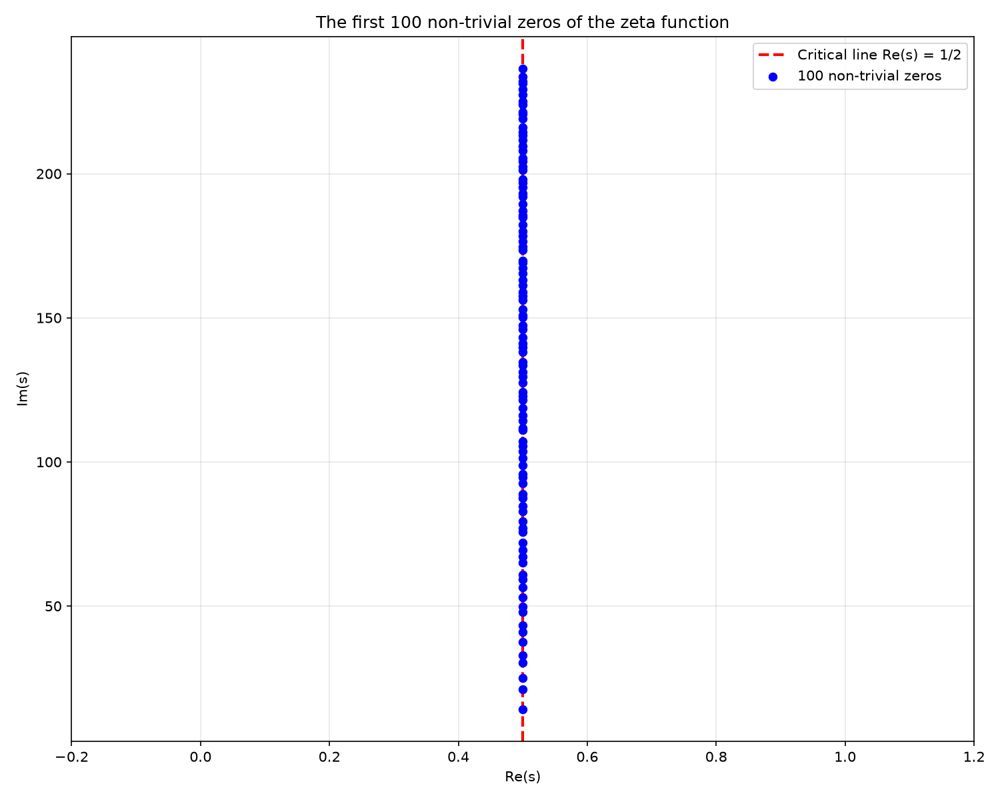
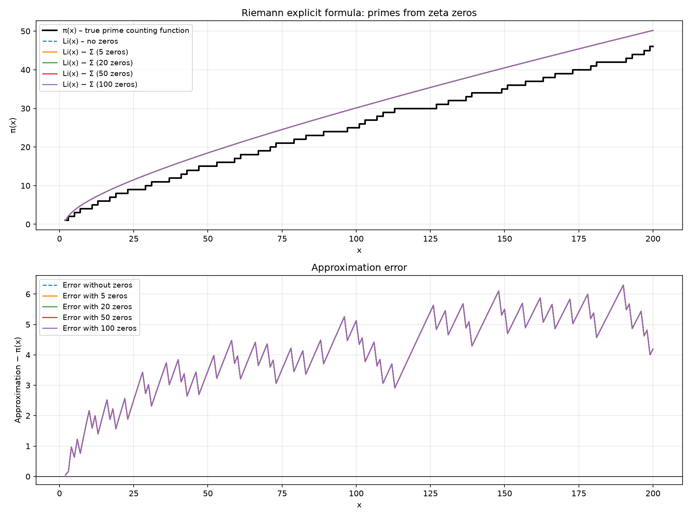
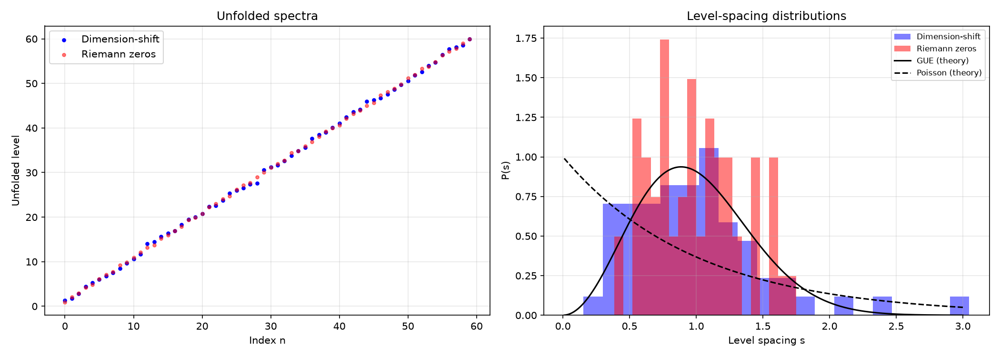
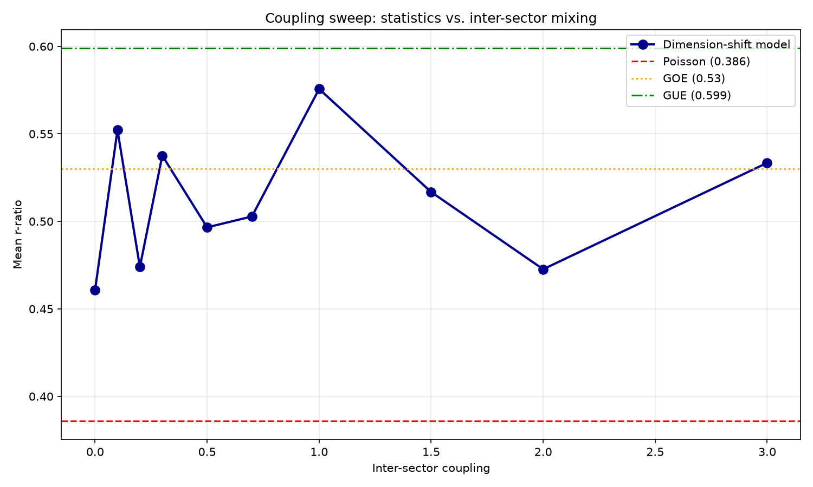
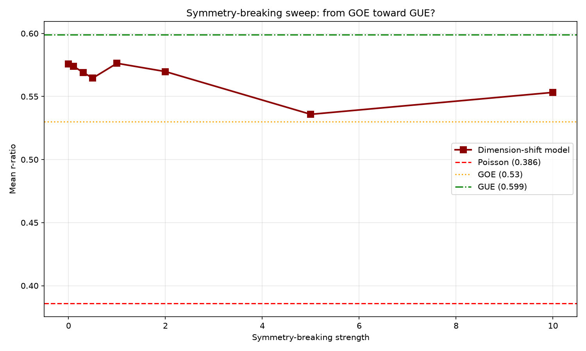
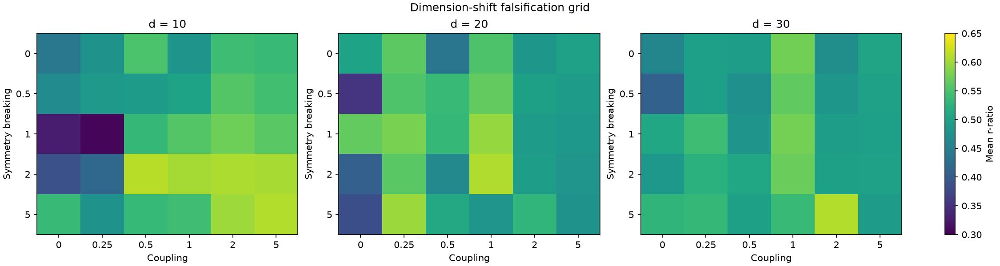
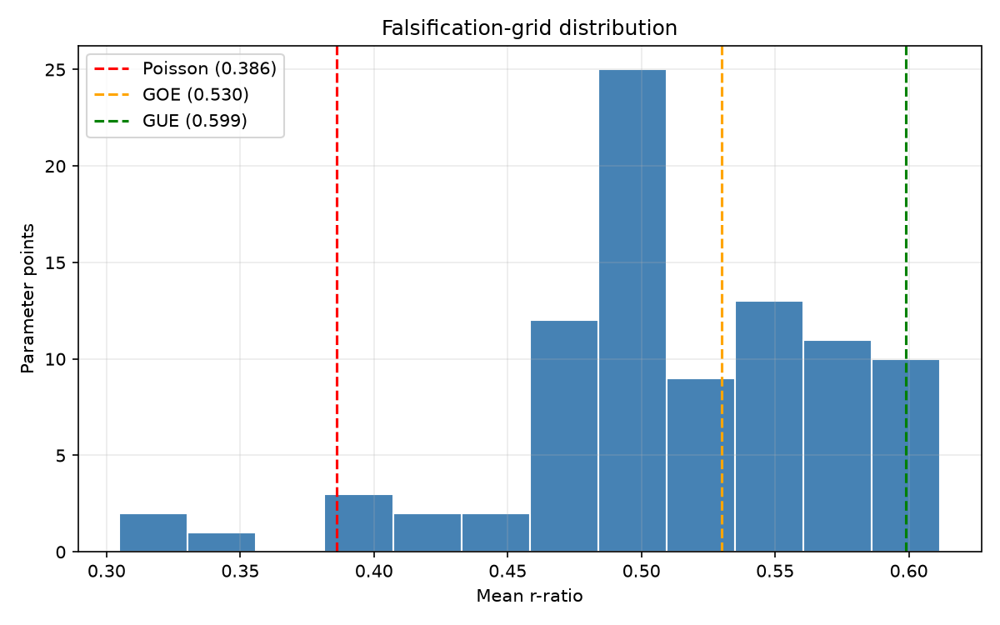

# Riemann Framework

Riemann Framework is an experimental research project for exploring and
verifying approaches to the Riemann Hypothesis (RH). It combines numerical
experiments in Python with a planned Lean 4 formalization, including
computations involving zeta zeros, the explicit formula, prime counting, and
dimension-shift models. The project does **not** claim to prove the Riemann
Hypothesis; computational results and passing tests are research evidence,
not a completed mathematical proof.

## Disclaimer

This project is **not a proof** of the Riemann Hypothesis. It is a tool to:
- test the RH **numerically** for known zeros,
- verify **formal proof attempts** in Lean 4,
- visualize and analyze the **explicit formula**.

A passing test is **evidence**, not a mathematical proof.

## Status

| Component | Status |
|:---|:---|
| Numerical zero verification | Working |
| Explicit-formula calculations and plots | Working |
| Dimension-shift experiments | Working and exploratory |
| Dimension-shift falsification grid | Working; single seed, verdict interpretation still coarse |
| DSIN communication simulation | Working as a toy simulation; no security proof |
| Lean formalization of RH | Involution and eigenspace lemmas; RH formalization not started |
| Primon-gas anchor | Exact trace identity implemented and tested; anchors the Euler product, not the zeros |
| Formal proof of RH | Open problem |

## Screening candidate ideas

The repository includes a small gate for candidate operations on the complex
slice, adapted from an external idea-vetting prototype. It answers one narrow
question: is the formula affine in `(s, conjugate(s))`? If so it is a known
similarity of the plane (rotation/scaling/translation) and not a new algebraic
object.

```python
from riemann_framework.affine_reduction import check_affine_reduction

result = check_affine_reduction("1 - s_conj")
print(result.is_affine)      # True  -> a known affine map
print(result.coefficients)   # (0j, (-1+0j), (1+0j))  -> 0*s - 1*conj(s) + 1
```

This records an honest negative result rather than a success: the
dimension-shift prototype `sigma(s) = 1 - conjugate(s)` is the
functional-equation reflection composed with conjugation, so it adds no new
algebra. Its fixed locus is nevertheless exactly `Re(s) = 1/2`, which is the
property the proposal actually needs. See `docs/dimension_shift_involution.md`
section 2.1.

## The primon gas: an exact arithmetic anchor

The one place in this repository where the Euler product is not modelled but
*provably present*. On `l^2(N)` with basis `|n>` and `H|n> = log(n)|n>`,

```text
Tr[e^{-sH}] = sum_n n^{-s} = zeta(s)      exactly, for Re(s) > 1
```

— Julia (1990), Spector (1990), refined into the Bost-Connes system (1995). The
Euler product falls out of unique factorisation: `l^2(N)` is the Fock space of
independent bosonic oscillators, one per prime, with energy `log(p)`.

```python
from riemann_framework.primon_gas import trace_convergence

result = trace_convergence(2.0, truncations=(10, 100, 1000, 10_000, 100_000))
print(result["relative_errors"])   # decreasing, ~0.6/N at s = 2
```

This gives candidate symmetries a real target instead of a statistical one:
does your proposed symmetry commute with the one operator whose trace is the
Euler product? `riemann_framework/operator_symmetry.py` runs that test and
records a **negative result** — the natural lift of the dimension-shift
involution onto `l^2(N)`, swapping two primes' exponents, *provably cannot*
commute with `H`, because `H` has simple spectrum while the permutation is not
diagonal.

Two things this does **not** do: the eigenvalues of `H` are `log(n)`, not the
imaginary parts of the zeta zeros, so it anchors the Euler product and not the
zero locations; and the obstruction above is a statement about basis
permutations specifically, not about the dimension-shift programme as a whole.
See `docs/central_hypothesis.md` section 3.

## Goal

The Riemann Hypothesis states that all non-trivial zeros of the
Riemann zeta function lie on the critical line `Re(s) = 1/2`.

This framework combines:
- **Python** (mpmath, numpy, matplotlib) for numerical verification and visualization,
- **Lean 4 + Mathlib** as a planned formalization target,
- **pytest** as the test infrastructure (unit-test metaphor for the RH).

## Generated Results

Plots are generated locally and are not required source files. From the
repository root, run:

```powershell
python python/riemann_framework/test_plot.py
python scripts/run_dimension_shift_chaos.py
python scripts/run_falsification.py
```

The scripts write PNG files to `output/`, including zero plots,
explicit-formula plots, spectrum comparisons, coupling sweeps, symmetry-breaking
sweeps, and the falsification grid. The current plot snapshots are included
below.

### Non-trivial zeros in the complex plane



### Explicit formula approximation



### Dimension-shift spectrum comparison



### Dimension-shift coupling sweep



### Dimension-shift symmetry-breaking sweep



### Dimension-shift falsification grid

The falsification test scans a grid of dimension-shift parameters and reports
each point's mean adjacent-gap ratio `r`, then compares it with matched
Poisson, GOE, GUE, and Riemann reference systems.





The heatmap shows mean `r` for every combination of sector dimension,
coupling, and symmetry breaking; the histogram shows how those 90 parameter
points distribute relative to the reference values (dashed lines). Both are
written by `scripts/run_falsification.py`, which also records the run in
[`output/falsification_summary.txt`](output/falsification_summary.txt).

## Project Structure


```
riemann-framework/
│
├── README.md                     # Main documentation
├── LICENSE                       # GPL-3.0
├── .gitignore                    # Exclude Python, Lean, VS Code artifacts
├── lakefile.toml                 # Lean 4 project definition
├── lean-toolchain                # Lean version pin (e.g. leanprover/lean4:v4.x.x)
│
├── lean/                         # Lean 4 formalization
│   ├── RiemannFramework.lean         # Aggregate module (library root)
│   └── RiemannFramework/
│       ├── DimensionShift.lean       # Sector swap is an involution
│       └── InvolutionEigenspace.lean # Involution eigenspace lemmas
│
├── python/                       # Numerical tests and control logic
│   ├── pyproject.toml            # Project definition (uv/pip)
│   ├── requirements.txt          # numpy, matplotlib, mpmath, pytest
│   │
│   ├── riemann_framework/        # Python package
│   │   ├── __init__.py
│   │   ├── zeta.py               # mpmath wrapper for ζ(s)
│   │   ├── zeros.py              # Computation / verification of zeros
│   │   ├── explicit_formula.py   # Riemann explicit formula
│   │   ├── dimension_shift.py    # Dimension-shift operator model
│   │   ├── dimension_shift_chaos.py # Hamiltonian chaos experiments
│   │   ├── quantum_chaos.py       # Zero-spacing statistics
│   │   ├── dsin.py                # DSIN communication simulation
│   │   ├── statistics.py          # Spectral statistics utilities
│   │   ├── spectral_density.py    # Riemann-von Mangoldt diagnostics
│   │   ├── affine_reduction.py    # Affine-reduction gate for candidate maps
│   │   ├── primon_gas.py          # Exact anchor: Tr[e^{-sH}] = zeta(s)
│   │   ├── operator_symmetry.py   # Screens symmetries against the primon H
│   │   ├── lean_runner.py        # Compiles Lean files via subprocess
│   │   └── plots.py              # Plot generation
│   │
│   └── tests/                    # pytest tests
│       ├── test_numeric_zeros.py     # Numerical assert
│       ├── test_formal_proof.py      # Formal assert (Lean)
│       ├── test_explicit_formula.py  # Test of the explicit formula
│       ├── test_dimension_shift.py   # Dimension-shift tests
│       ├── test_dimension_shift_chaos.py # Chaos pipeline tests
│       ├── test_quantum_chaos.py     # Zero statistics tests
│       ├── test_affine_reduction.py  # Records the affine-reduction result
│       ├── test_primon_gas.py        # Exact trace identity + the failed lift
│       └── test_dsin.py              # DSIN simulation tests
│
├── scripts/                      # Helper scripts
│   ├── setup_lean.sh             # Set up Lean + Mathlib
│   ├── generate_plots.py          # Generate standard plots
│   ├── run_dimension_shift_chaos.py # Generate chaos plots
│   ├── run_quantum_chaos_analysis.py # Zero-spacing statistics
│   ├── check_sigma.py             # Verify the sector-swap involution
│   ├── run_dsin_analysis.py       # Run DSIN simulations
│   └── run_falsification.py       # Run DSH grid and write artifacts
│
├── docs/                         # Documentation
│   ├── research_notes.md         # What has been tried so far
│   ├── number_systems.md         # Your idea with new number systems
│   ├── spherical_number_systems.md # Hypothetical higher-dimensional model
│   ├── dimension_shift_involution.md # Discrete involution proposal
│   ├── dimension_shift_quantum_chaos.md # Quantum-chaos extension
│   ├── dimension_shift_computational_approach.md # Computational methodology
│   ├── dimension_shift_quantum_communication.md # DSIN communication proposal
│   ├── project_critique_and_roadmap.md # Critical assessment and milestones
│   ├── central_hypothesis.md       # Falsifiable dimension-shift hypothesis
│   ├── lessons_learned.md          # Negative results and limitations
│   ├── scientific_contribution_assessment.md # Current scientific status
│   ├── future_work.md               # Engineering and research roadmap
│   └── verification.md           # How an RH proof is checked
│
├── output/                       # Generated plots
│   ├── *.png                     # Plot snapshots embedded in this README
│   └── falsification_summary.txt # Latest falsification-grid run
│
└── .github/
    └── workflows/
        └── ci.yml                # GitHub Actions: run tests automatically
```

## License

This project is licensed under the **GNU General Public License v3.0**.

See [`LICENSE`](LICENSE) for the full text.

**Note:** The Lean library **Mathlib** is licensed under the
Apache License 2.0 and is compatible with GPL v3. See
[Mathlib LICENSE](https://github.com/leanprover-community/mathlib4/blob/master/LICENSE).

## Third-Party Software

This project uses third-party dependencies with their own licenses,
including mpmath, NumPy, Matplotlib, pytest, Lean, and Mathlib. Their
respective licenses remain applicable to those components.