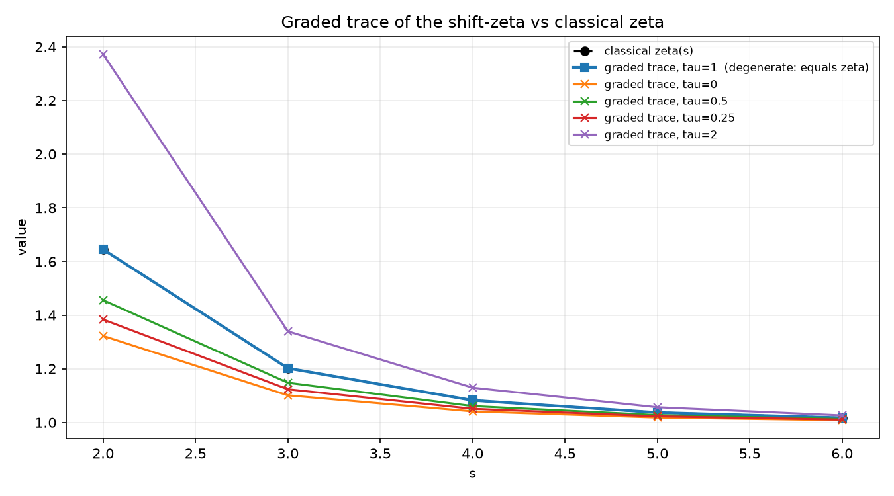
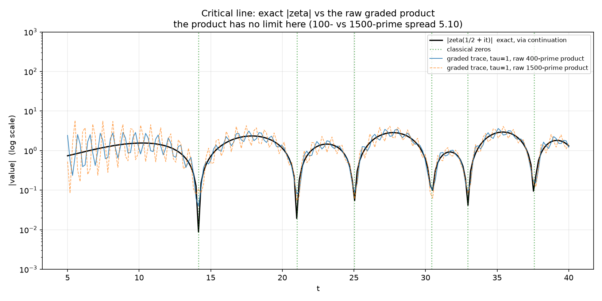
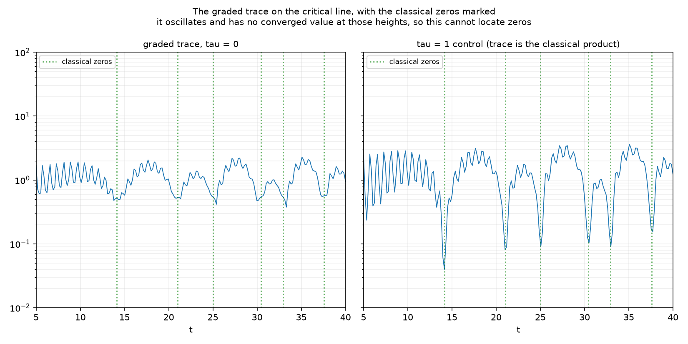
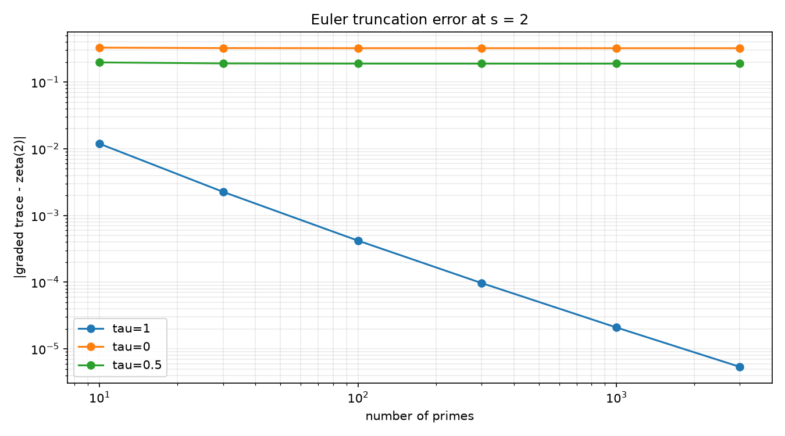

# Riemann Framework

Riemann Framework is an experimental workbench for exploring the Riemann
Hypothesis (RH), not a proof attempt. It combines numerical experiments in
Python with a Lean 4 formalization, covering zeta zeros, the explicit formula,
prime counting, dimension-shift models, graded algebras, and exotic number
systems.

Speculative ideas are stated precisely, tested against real mathematics and
real controls, and reported honestly, including when they fail. Several tracks
here *do* fail, on purpose and on record: a negative result obtained by a
stated method is worth more than an unfalsifiable claim of progress. Nothing in
this repository claims to prove RH; passing tests are research evidence, not a
completed proof.

## Disclaimer

This project is **not a proof** of the Riemann Hypothesis. It is a tool to:

- test the RH **numerically** for known zeros,
- verify **formal proof attempts** in Lean 4,
- visualize and analyze the **explicit formula**.

A passing test is **evidence**, not a mathematical proof.

## Status

| Component | Status |
|:---|:---|
| Numerical zero verification | Working |
| Explicit-formula calculations and plots | Working |
| Dimension-shift experiments | Working and exploratory |
| Dimension-shift falsification grid | Working; single seed, verdict interpretation still coarse |
| DSIN communication simulation | Working as a toy simulation; no security proof |
| Lean formalization of RH | Involution and eigenspace lemmas proved; RH formalization not started |
| Primon-gas anchor | Exact trace identity implemented and tested; anchors the Euler product, not the zeros |
| Shift-zeta (graded algebra) | **Negative result.** Well-defined and tested; does **not** reproduce the classical zeros. See [`docs/shift_zeta_result.md`](docs/shift_zeta_result.md) |
| Cayley-Dickson / four-square study | Confirms Hurwitz's dimension limit (1,2,4,8); confirms a genuine Euler-product identity at dimension 4 (`ζ(s)ζ(s-1)`), which does not by itself constrain the zeros of `ζ` |
| Idea-vetting pipeline | Working; five stages (A–E), enforced falsification criteria |
| Formal proof of RH | Open problem |

## The idea-vetting pipeline

Because this repository accumulates speculative proposals, every candidate idea
is expected to pass through the same gate before it is taken seriously. It is
implemented in `riemann_framework/idea_pipeline.py` and documented in
`docs/project_critique_and_roadmap.md`.

An "idea" is a small JSON record under `ideas/*.json` that must state, up
front, what observation would falsify it (stage E, enforced at construction).
Stages A–D2 reuse the existing modules:

| Stage | Question | Tooling |
|:---|:---|:---|
| **A** — Well-formedness | Is the proposed object/map even well-defined? | Parsing / manual review |
| **B** — Triviality reduction | Is it secretly an affine combination of `s` and `conjugate(s)` — i.e. a known rotation/reflection in disguise? | `affine_reduction.py` (numeric second-difference test) |
| **C** — Statistical plausibility | If it produces a spectrum, how does its level-spacing statistic compare to matched Poisson / GOE / GUE baselines? | Gap-ratio statistics with bootstrap confidence intervals |
| **D** — Arithmetic coupling | Does the map interact with the primes at all (via Euler-factor exponents `p^{-s}`), or only with the geometry of the plane? | Numeric probe against `p^{-s}` |
| **D2** — Operator realization | If a symmetry is proposed on the *primon gas* (Track 4), does it actually commute with the Hamiltonian? | Commutator norm test |
| **E** — Falsifiability | Does the idea state, in advance, what observation would count against it? | Enforced by the `ideas/*.json` / `*.yaml` schema at construction time |

```bash
python scripts/run_idea_pipeline.py
```

No verdict here ever says an idea is "true" or "proven" — only how far it got
before hitting a known limitation, a statistical mismatch, or a genuinely open
question. `ideas/` currently records, among others, `dimension_shift_w` (fails
stage B — it is exactly the functional-equation reflection), and
`dimension_lift_euler_product` (clears stage B non-trivially and produces a
real, if limited, Euler-product identity — see Track 5).

The stage-D probe (`probe_multiplicative_coupling`) was corrected from an
earlier prototype version whose per-prime relative error cancelled the `log p`
factor, making its "p-dependent mismatch" flag provably unreachable. The
corrected comparison is `w(p^{-s})` versus `p^{-w(s)}`, which the identity map
satisfies exactly (spread ~0) and the reflection `1 - conj(s)` does not
(spread ~0.28).

## Track 1 — Numerical core

The foundation everyone else builds on:

- **`zeta.py` / `zeros.py`** — thin, careful `mpmath` wrappers for evaluating `ζ(s)` and locating/verifying non-trivial zeros to arbitrary precision.
- **`explicit_formula.py`** — the Riemann–von Mangoldt explicit formula linking sums over zeros to sums over prime powers, with regularization for numerical evaluation.
- **`spectral_density.py`** — diagnostics comparing a cumulative zero count against the Riemann–von Mangoldt asymptotic `N(T) ~ (T/2π)log(T/2πe)`.
- **`plots.py` / `generate_plots.py` / `test_plot.py`** — the plotting layer behind every figure in this README.

This layer makes no novel claims; it exists so every other track has a trustworthy ground truth to compare against.

## Track 2 — The dimension-shift programme

### The central hypothesis

Documented in full in `docs/central_hypothesis.md`. The **Dimension-Shift Hypothesis (DSH)** conjectures a family of self-adjoint Hamiltonians `H(λ)` on a `Z₂`-graded Hilbert space, together with a discrete involution `σ`, such that:

1. `[H(λ), σ] = 0` in the intended regime;
2. the spectral density of `H(λ)` matches the Riemann–von Mangoldt asymptotic;
3. a precisely defined spectral subsequence corresponds to the non-trivial zeta zeros;
4. a fixed-locus or positivity argument forces those zeros onto `Re(s) = 1/2`;
5. the local level statistics are GUE-like.

This is intentionally a stronger requirement than "the model looks chaotic" — GUE statistics alone are cheap and do not by themselves encode the Euler product or any individual zero.

### The prototype involution

On the complex plane the prototype is the reflection

```
σ(s) = 1 - conjugate(s),        σ(σ(s)) = s,        σ(s) = s  ⟺  Re(s) = 1/2
```

Run through the vetting pipeline (`affine_reduction.py`), this is honestly recorded as a **known affine map** — the functional-equation reflection composed with conjugation — not a new algebraic object:

```python
from riemann_framework.affine_reduction import check_affine_reduction

result = check_affine_reduction("1 - s_conj")
print(result.is_affine)      # True  -> a known affine map
print(result.coefficients)   # (0j, (-1+0j), (1+0j))  -> 0*s - 1*conj(s) + 1
```

Its fixed locus is nonetheless exactly the critical line, which is the property the wider programme actually needs; see `docs/dimension_shift_involution.md` §2.1 for the full discussion of why triviality as an algebraic object does not disqualify it as a *symmetry* to build a Hamiltonian around.

### Chaos models, statistics, and the falsification grid

- **`dimension_shift_chaos.py`** — a family of coupled Hamiltonians built around the sector-swap involution, with a coupling and a symmetry-breaking parameter.
- **`quantum_chaos.py` / `statistics.py`** — mean adjacent-gap ratio statistics (`⟨r⟩`), matched against Poisson (`≈0.386`), GOE (`≈0.531`), and GUE (`≈0.600`) reference values, with bootstrap confidence intervals.
- **`falsification_test.py`** — scans a grid over sector dimension, coupling strength, and symmetry breaking (90 parameter points), classifies each as Poisson-like / GOE-like / GUE-like / intermediate, and writes the result to `output/falsification_summary.txt` plus the heatmap and histogram figures below. This is stronger than presenting only favorable plots: it also exposes the parameter regions that do **not** support the target behavior.

### DSIN: a toy communication-channel simulation

**`dsin.py`** explores whether the dimension-shift structure could underlie a communication protocol. This is explicitly labeled a toy simulation with **no security proof** — it should not be equated with cryptographic protocols like BB84, and the documentation (`docs/dimension_shift_quantum_communication.md`) is explicit about this limitation.

## Track 3 — Shift-zeta: a graded-algebra lift (negative result)

Full detail in `docs/shift_zeta_result.md`; this is the most rigorously negative result in the repository, and it is reported as such rather than downplayed.

**The question:** does lifting the Euler product into a `Z₂`-graded algebra `A = A₀ + ωA₁` (with `ω² = 1`, involution `σ(x) = ωxω`, and local factors `1/(1 - p^{-s}γ_τ)` where `γ_τ = ((1+τ)/2)I + ((1-τ)/2)ω`) force the zeros of the resulting "shift-zeta" into the fixed locus `Fix(σ) = A₀` (i.e. the critical line's algebraic analogue)?

**The answer: no.** Measured over 600 primes:

- The algebra is well-defined, and `σ` is a genuine algebra homomorphism (**G1, G2 pass**).
- The graded trace is `σ`-invariant; the supertrace is `σ`-*anti*-invariant — these are different, non-conflicting functionals (**G3, F5 both hold**).
- At `τ = 1` — the degenerate control case — the graded trace equals the classical Euler product term for term (relative error `5.1×10⁻⁴` at `s=2`, pure truncation) (**G7 passes**). This confirms the methodology is sound: the machinery *can* reproduce `ζ` exactly when it is supposed to.
- For `τ ≠ 1`, the trace departs from `ζ` by **11%–44%** at `s=2`, and the completion (functional-equation) symmetry fails with residuals of `10⁻²`–`10⁻¹`, three to ten orders of magnitude above the numerical noise floor of the `τ=1` control (**G5 fails**).
- Most decisively: at `τ=1`, where the trace is provably the classical product, it dips sharply and exactly at every classical zero — a positive control showing the diagnostic works. At `τ≠1`, the trace is instead **3.5×–7.5× larger** at those same heights, with no corresponding dip. The zero sets do not coincide (**G6 fails**, triggering falsification criterion **F1**).

**Why it fails, structurally:** every local factor in the graded product is a polynomial in a single element `γ_τ`, so the product never leaves the two-dimensional subalgebra `C[γ_τ]` — there is no interaction between different primes' contributions inside the grading. This is the concrete mechanism, not just an empirical shortfall, and it is the kind of obstruction the framework's own Stage-D arithmetic-coupling test is designed to catch in future proposals before months are spent on them.

No criterion failure here says anything about whether RH is true; it says this specific graded lift does not reproduce the classical zeros, and it explains why in terms that generalize to other naive lifts.

```powershell
python scripts/run_shift_zeta_analysis.py
```

The figures below are diagnostic, not evidence about zero locations; read the caveats in `scripts/run_shift_zeta_analysis.py` before drawing conclusions from them.









## Track 4 — The primon gas: an exact arithmetic anchor

The one place in this repository where the Euler product is not modeled or approximated but **provably present**, due to Julia (1990) and Spector (1990), refined into the Bost–Connes system (1995).

On `ℓ²(ℕ)` with orthonormal basis `|n⟩`, define the diagonal Hamiltonian

```
H|n⟩ = log(n)|n⟩
```

Then, exactly, for `Re(s) > 1`:

```
Tr[e^{-sH}] = Σ_n n^{-s} = ζ(s) = Π_p 1/(1 - p^{-s})
```

This falls directly out of unique prime factorization: `ℓ²(ℕ)` is the Fock space of independent bosonic oscillators, one per prime `p`, each with energy `log(p)`. `primon_gas.py` implements the finite truncation (`n = 1..N`) and confirms numerically that the truncated trace converges monotonically to `ζ(s)` as `N` grows:

```python
from riemann_framework.primon_gas import trace_convergence

result = trace_convergence(2.0, truncations=(10, 100, 1000, 10_000, 100_000))
print(result["relative_errors"])   # decreasing, ~0.6/N at s = 2
```

This gives candidate symmetries a genuine target instead of a merely statistical one: **does a proposed symmetry commute with the one operator whose trace is the Euler product?** `operator_symmetry.py` runs exactly this test and records a clean negative result: the natural lift of the dimension-shift involution onto `ℓ²(ℕ)` — a permutation swapping two primes' exponents in each integer's factorization — **provably cannot** commute with `H`, because `H` has strictly simple spectrum (`log` is injective on positive integers) and any operator commuting with a diagonal matrix of simple spectrum must itself be diagonal. This rules out an entire natural-looking family of symmetry proposals (basis permutations) in one linear-algebra fact, confirmed numerically at several truncation sizes to show the failure does not shrink with `N`.

**What this does not do:** the eigenvalues of `H` are `log(n)`, not the imaginary parts of the zeta zeros. This anchors the Euler product; it says nothing about the location of the zeros. Reaching the zeros requires the much harder, still partially open Connes (1999) adele-class-space construction — see `docs/central_hypothesis.md` §3 for the full discussion of what would still be needed.

## Track 5 — Cayley-Dickson and the four-square theorem: does dimension-lifting create an Euler product?

This track directly tests an intuition: since extending `ℝ` to `ℂ` (via `i`) unlocked new structure, could repeating that doubling — circle → sphere → higher-dimensional sphere — produce something with genuine arithmetic content?

**`cayley_dickson.py`** implements the actual doubling construction `ℝ → ℂ → ℍ → 𝕆 → sedenions → ...` at any power-of-two dimension, and numerically confirms, rather than merely cites, the **Hurwitz theorem (1898)**: a normed division algebra over `ℝ` exists only at dimensions 1, 2, 4, and 8.

| Step | Dimension | Property lost |
|:---|:---:|:---|
| `ℝ → ℂ` | 2 | Total order |
| `ℂ → ℍ` | 4 | Commutativity |
| `ℍ → 𝕆` | 8 | Associativity |
| `𝕆 → sedenions` | 16 | Zero-divisor freedom (no longer a division algebra at all) |

Each collapse is demonstrated directly — for the sedenions, by an explicit constructed pair of non-zero elements whose product is (numerically) zero — not asserted from the literature.

**`four_squares.py`** then tests the harder, genuinely useful question: does the lift from 2D (Gaussian integers) to 4D (Lipschitz/Hurwitz quaternions) produce real Euler-product content? **Yes, concretely:** Jacobi's four-square theorem (1834), `r₄(n) = 8·Σ_{d|n, 4∤d} d`, verified here both by brute-force lattice-point counting on the 4-sphere and by formula, yields the genuine Dirichlet-series identity

```
Σ_n σ(n)/n^s = ζ(s)·ζ(s-1)
```

confirmed numerically against `mpmath.zeta` to a relative error of `~1.7×10⁻⁵` at `s=3` with 50,000 terms.

**The honest limit**, recorded in `ideas/dimension_lift_euler_product.yaml`: `ζ(s)·ζ(s-1)` is built from ordinary `ζ` evaluated at two separate points — it is not a new function whose own zeros need to sit on any critical line, and it says nothing about where `ζ`'s zeros are. The dimension-lift intuition is validated as producing real arithmetic content at this specific instance; turning that into something that *constrains* `ζ`'s own zeros remains the open, and much harder, part — exactly the gap that has kept every operator-theoretic RH programme, including this one, from closing since Hilbert and Pólya first proposed the idea around 1910–1915.

## Lean 4 formalization

Everything under `lean/` is compiled by [`lean_runner.py`](python/riemann_framework/lean_runner.py)
as part of the test suite, so formal claims cannot silently rot out of sync with the code.

**Sorry-free — genuinely machine-verified:**

- **`RiemannFramework.lean`** — the aggregate library root. It imports only the sorry-free
  modules below, so `lake build --wfail` stays green.
- **`RiemannFramework/DimensionShift.lean`** — proves the sector-swap map is an involution.
- **`RiemannFramework/InvolutionEigenspace.lean`** — eigenspace lemmas for that involution.

**Statements of the target — every one still contains `sorry`, because the problem is open:**

- **`RiemannFramework/RiemannHypothesis.lean`** — a minimal RH statement over Mathlib's `riemannZeta`.
- **`RiemannFramework/RiemannHypothesis_optimized.lean`** — the Clay Millennium formulation
  (namespace `Millennium`): `ClayRiemannHypothesis` is proved equivalent to Mathlib's
  `_root_.RiemannHypothesis` and to the real-part and Riemann `ξ(t)` wordings. This file is a
  derivative work — see [`THIRD_PARTY_NOTICES`](THIRD_PARTY_NOTICES).
- **`RiemannFramework/ZetaConjecture.lean`** — the framework's own dimension-shift reduction:
  RH follows *if* every nontrivial zero is fixed by `σ(s) = 1 - conj s`, the reflection in the
  critical line. The remaining step, `prove_rh_via_dimension_shift`, is `sorry`.
- **`RiemannFramework/SanityChecks.lean`** — worked examples confirming `σ` behaves as expected.

**The pipeline interface:**

- **`RiemannFramework/NewIdeaTest.lean`** — defines `RHIdea`, the three obligations a candidate
  operator must discharge: that it is an involution, that its fixed points lie on the critical
  line (`eval_re`), and that every nontrivial zero is fixed by it (`fixed_on_zeros` — the wall).
  `RHIdea.riemannHypothesisStatement` proves those obligations are *sufficient* for RH, so the
  wall is exactly where a candidate is filtered out. The file registers `myNewOperator := 1 - conj s`
  and discharges the first two; the third is `sorry`, because it is the open problem. What is
  machine-checked is the implication plus obligations 1–2 — the pipeline is sound, not complete.

This is a first, small, genuinely formally verified result — not a formalization of RH, and the
repository does not claim otherwise. The test `test_rh_statement_stays_open` actively asserts that
each RH-target file still reports `sorry`, so an accidental "RH is proved" claim fails the build
rather than quietly editing the README.

## What this framework can and cannot validate

**What it can do.** It runs a candidate idea through stages A–D2 (see [The idea-vetting pipeline](#the-idea-vetting-pipeline)) and tells you how far it gets before hitting a known limitation. This is valuable as a **filter against self-deception** — it stops you from spending months on an idea that is actually just a renamed reflection.

**What it cannot do.** It can never confirm that something is a proof of RH — and for a structural reason, not a limitation we could simply fix.

The framework works with **numerical samples and heuristic tests** (a few hundred primes, finite truncations, bootstrap confidence intervals). A test that was not falsified at `N = 100,000` is never a proof for all `N` — that is the fundamental difference between "not empirically falsified" and "mathematically proven." Even if an idea clears every stage A–E, the framework says, at best: "this idea has none of the known pitfalls we know how to check for." That is nowhere close to a proof.

The only part of this repository that even points in the direction of "validating a proof" is Lean 4 — `DimensionShift.lean` and `InvolutionEigenspace.lean` are genuine, machine-verified proofs, but only of small helper lemmas, not of RH itself. An actual proof of RH would have to be **fully formalized in Lean** — every step, every definition, all the way down to Mathlib's axioms — and would then be accepted or rejected by Lean itself, not by this framework. That is an order of magnitude more work than everything currently in `lean/`, and no one in the world has even begun this for RH (formalizing a century-old open problem is a multi-year undertaking even once a proof exists — see Kevin Buzzard's initiative to formalize Fermat's Last Theorem).

**If you genuinely believe you have found something.** Should an idea clear every stage and look mathematically watertight to you:

1. **Don't trust the framework — trust people.** Post the concrete mathematical claim (not the code) on MathOverflow or an appropriate specialist forum and ask for counterexamples.
2. **Check whether it has already been refuted.** The history of RH is full of promising-looking approaches that fail at a subtle point — often exactly at the Euler-product coupling, as we have seen repeatedly in this repository's own negative results.
3. **Only then think about formalization** — and even then, the path through Lean/Mathlib is years, not weeks.

**Honest advice, without wanting to take away your motivation:** this framework is an excellent tool for quickly discarding bad ideas and sharpening promising ones. But it is — and structurally can never be more than — a pre-filter. Confirmation of a real proof does not happen through code that prints "PASS"; it happens through human expert scrutiny and, ideally, full formal verification.

## Generated Results

Plots are generated locally and are not required source files. From the
repository root, run:

```powershell
python python/riemann_framework/test_plot.py
python scripts/run_dimension_shift_chaos.py
python scripts/run_falsification.py
```

The scripts write PNG files to `output/`, including zero plots,
explicit-formula plots, spectrum comparisons, coupling sweeps, symmetry-breaking
sweeps, and the falsification grid. The current plot snapshots are included
below.

### Non-trivial zeros in the complex plane


### Explicit formula approximation


### Dimension-shift spectrum comparison


### Dimension-shift coupling sweep


### Dimension-shift symmetry-breaking sweep


### Dimension-shift falsification grid

The falsification test scans a grid of dimension-shift parameters and reports
each point's mean adjacent-gap ratio `r`, then compares it with matched
Poisson, GOE, GUE, and Riemann reference systems.


The heatmap shows mean `r` for every combination of sector dimension,
coupling, and symmetry breaking; the histogram shows how those 90 parameter
points distribute relative to the reference values (dashed lines). Both are
written by `scripts/run_falsification.py`, which also records the run in
[`output/falsification_summary.txt`](output/falsification_summary.txt).

## Project Structure

```
riemann-framework/
│
├── README.md                     # Main documentation
├── LICENSE                       # GPL-3.0
├── THIRD_PARTY_NOTICES           # Apache 2.0 attribution (LeanMillenniumPrizeProblems)
├── .gitignore                    # Exclude Python, Lean, VS Code artifacts
├── pyrightconfig.json            # Type-checker config (extraPaths + mpmath stub)
├── lakefile.toml                 # Lean 4 project definition
├── lake-manifest.json            # Lean dependency manifest (mathlib pin)
├── lean-toolchain                # Lean version pin (e.g. leanprover/lean4:v4.x.x)
│
├── lean/                         # Lean 4 formalization
│   ├── RiemannFramework.lean         # Aggregate module (library root, sorry-free only)
│   └── RiemannFramework/
│       ├── DimensionShift.lean       # Sector swap is an involution (sorry-free)
│       ├── InvolutionEigenspace.lean # Involution eigenspace lemmas (sorry-free)
│       ├── RiemannHypothesis.lean       # Minimal RH statement (`sorry`)
│       ├── RiemannHypothesis_optimized.lean # Clay Millennium formulation (`sorry`)
│       ├── ZetaConjecture.lean          # σ(s) = 1 - conj s reduction (`sorry`)
│       ├── NewIdeaTest.lean             # `RHIdea` pipeline interface + demo (`sorry`)
│       └── SanityChecks.lean            # Worked examples for σ
│
├── python/                       # Numerical tests and control logic
│   ├── pyproject.toml            # Project definition (uv/pip)
│   ├── requirements.txt          # numpy, matplotlib, mpmath, pytest
│   │
│   ├── riemann_framework/        # Python package
│   │   ├── zeta.py               # mpmath wrapper for ζ(s)
│   │   ├── zeros.py              # Computation / verification of zeros
│   │   ├── explicit_formula.py   # Riemann explicit formula
│   │   ├── dimension_shift.py    # Dimension-shift operator model
│   │   ├── dimension_shift_chaos.py # Hamiltonian chaos experiments
│   │   ├── quantum_chaos.py       # Zero-spacing statistics
│   │   ├── dsin.py                # DSIN communication simulation
│   │   ├── statistics.py          # Spectral statistics utilities
│   │   ├── spectral_density.py    # Riemann-von Mangoldt diagnostics
│   │   ├── falsification_test.py  # DSH falsification grid + verdicts
│   │   ├── affine_reduction.py    # Affine-reduction gate for candidate maps
│   │   ├── idea_pipeline.py       # A–E vetting pipeline + Stage-D probe
│   │   ├── primon_gas.py          # Exact anchor: Tr[e^{-sH}] = zeta(s)
│   │   ├── operator_symmetry.py   # Screens symmetries against the primon H
│   │   ├── graded_algebra.py      # Z2-graded algebra A = A0 + omega*A1
│   │   ├── graded_algebra_even_odd.py # even/odd interface of the graded algebra
│   │   ├── shift_zeta.py          # Lifted Euler product and its comparison
│   │   ├── cayley_dickson.py      # Cayley-Dickson construction R→C→H→O→…
│   │   ├── four_squares.py        # Jacobi four-square / sphere→Euler-product
│   │   ├── lean_runner.py         # Compiles Lean files via subprocess
│   │   ├── generate_plots.py      # Plot generation entry point
│   │   ├── test_plot.py           # Plot demo entry point
│   │   └── plots.py               # Plot generation
│   │
│   ├── examples/                  # Runnable idea/analysis examples
│   │   ├── run_cayley_dickson_example.py    # Cayley-Dickson collapse demo
│   │   ├── run_dimension_lift_example.py    # Dimension-lift Euler-product check
│   │   ├── run_dimension_shift_example.py   # Vet dimension-shift idea through A–E
│   │   ├── run_four_squares_example.py      # Jacobi four-square demo
│   │   └── run_primon_gas_example.py        # Primon-gas anchor + prime-swap lift
│   │
│   └── tests/                    # pytest tests
│       ├── test_numeric_zeros.py     # Numerical assert
│       ├── test_formal_proof.py      # Formal assert (Lean)
│       ├── test_explicit_formula.py  # Test of the explicit formula
│       ├── test_dimension_shift.py   # Dimension-shift tests
│       ├── test_dimension_shift_chaos.py # Chaos pipeline tests
│       ├── test_quantum_chaos.py     # Zero statistics tests
│       ├── test_affine_reduction.py  # Records the affine-reduction result
│       ├── test_idea_pipeline.py     # Pipeline + Stage-D probe tests
│       ├── test_primon_gas.py        # Exact trace identity + the failed lift
│       ├── test_graded_algebra.py    # Graded algebra and shift-zeta (G1-G7)
│       ├── test_graded_algebra_even_odd.py # even/odd interface regressions
│       ├── test_falsification.py     # DSH falsification grid tests
│       ├── test_cayley_dickson.py    # Cayley-Dickson property checks
│       ├── test_dimension_lift.py    # Dimension-lift Euler-product checks
│       ├── test_four_squares.py      # Jacobi four-square checks
│       └── test_dsin.py              # DSIN simulation tests
│
├── scripts/                      # Helper scripts
│   ├── run_dimension_shift_chaos.py # Generate chaos plots
│   ├── run_quantum_chaos_analysis.py # Zero-spacing statistics
│   ├── check_sigma.py             # Verify the sector-swap involution
│   ├── run_dsin_analysis.py       # Run DSIN simulations
│   ├── run_idea_pipeline.py       # Vet ideas/*.json through stages A–E
│   ├── run_shift_zeta_analysis.py # Shift-zeta numbers + plots
│   ├── verify_graded_algebra_port.py # Verify the even/odd port corrections
│   └── run_falsification.py       # Run DSH grid and write artifacts
│
├── ideas/                         # Candidate-idea records (JSON, stage E enforced)
│   ├── dimension_shift_w.json
│   ├── dimension_shift_w_lifted_to_primon_gas.json
│   ├── nonlinear_probe_example.json
│   ├── dimension_lift_euler_product.yaml
│   └── dimension_lift_sphere_euler_product.yaml
│
├── docs/                         # Documentation
│   ├── research_notes.md         # What has been tried so far
│   ├── number_systems.md         # Your idea with new number systems
│   ├── spherical_number_systems.md # Hypothetical higher-dimensional model
│   ├── dimension_shift_involution.md # Discrete involution proposal
│   ├── dimension_shift_quantum_chaos.md # Quantum-chaos extension
│   ├── dimension_shift_computational_approach.md # Computational methodology
│   ├── dimension_shift_quantum_communication.md # DSIN communication proposal
│   ├── project_critique_and_roadmap.md # Critical assessment and milestones
│   ├── central_hypothesis.md       # Falsifiable dimension-shift hypothesis
│   ├── lessons_learned.md          # Negative results and limitations
│   ├── scientific_contribution_assessment.md # Current scientific status
│   ├── future_work.md               # Engineering and research roadmap
│   ├── shift_zeta_result.md         # Shift-zeta (graded algebra) negative result
│   └── verification.md           # How an RH proof is checked
│
├── typings/                      # Custom type stubs
│   └── mpmath/__init__.pyi       # mpmath signatures (fixes Pylance int-param inference)
│
├── output/                       # Generated plots
│   ├── *.png                     # Plot snapshots embedded in this README
│   └── falsification_summary.txt # Latest falsification-grid run
│
└── .github/
    └── workflows/
        └── ci.yml                # GitHub Actions: run tests automatically
```

## License

This project is licensed under the **GNU General Public License v3.0**.

See [`LICENSE`](LICENSE) for the full text.

**Note:** The Lean library **Mathlib** is licensed under the
Apache License 2.0 and is compatible with GPL v3. See
[Mathlib LICENSE](https://github.com/leanprover-community/mathlib4/blob/master/LICENSE).

**Note:** `lean/RiemannFramework/RiemannHypothesis_optimized.lean` is a derivative
work of the Riemann Hypothesis formalization in
[`lean-dojo/LeanMillenniumPrizeProblems`](https://github.com/lean-dojo/LeanMillenniumPrizeProblems),
licensed under the Apache License 2.0. Apache 2.0 is compatible with GPL v3;
the derived portions retain their Apache 2.0 license. The full Apache 2.0
license text and attribution are in [`THIRD_PARTY_NOTICES`](THIRD_PARTY_NOTICES).

## Third-Party Software

This project uses third-party dependencies with their own licenses,
including mpmath, NumPy, Matplotlib, pytest, Lean, Mathlib, and portions of
`lean-dojo/LeanMillenniumPrizeProblems`. Their respective licenses remain
applicable to those components.
